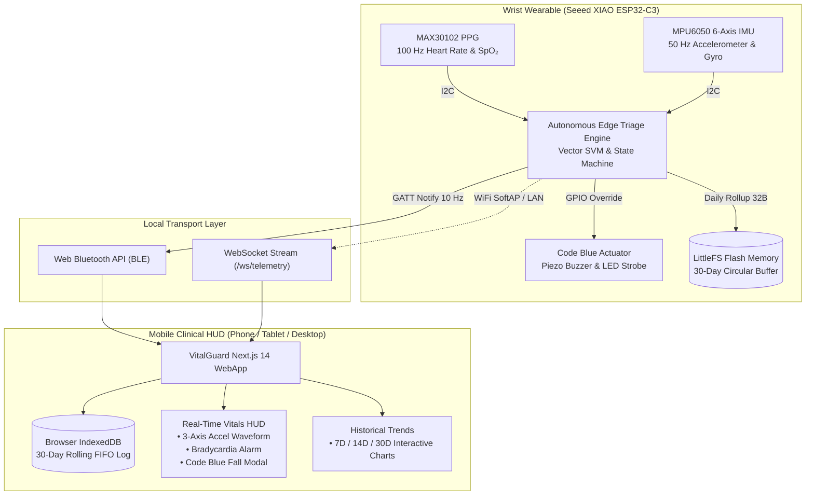

# VitalGuard C3 — The Sovereign Sentinel

<div align="center">


**Privacy-First Edge Wearable for Autonomous Fall Detection & Biometric Triage**  
*Sub-second (<200ms) decision latency • Zero cloud dependence • 30-day rolling local memory*

[Live HUD Demo](#-quickstart) • [Architecture](#-system-architecture) • [Hardware BOM](#-hardware-bill-of-materials-bom) • [Deploy Free](#-100-free-cloud-deployment)

</div>

---

## 🌟 Overview

**VitalGuard C3** is an ultra-low-cost, offline-first clinical wearable system designed for geriatric patients and high-risk medical wards. Unlike commercial smartwatches that route sensitive biometric streams through proprietary clouds, VitalGuard C3 runs **autonomous sensor triage directly on the wrist (ESP32-C3 RISC-V microcontroller)**.

- **Zero Cloud Dependence:** Zero biometric bytes leave the local domain. All triage and alerting occur on-chip.
- **Autonomous Actuation:** Triggers instant hardware alarms (piezo buzzer + visual strobes) without waiting for internet or Wi-Fi.
- **Dual 30-Day Persistence:** Combines on-chip flash memory (`LittleFS` ring buffer) with phone browser storage (`IndexedDB`) to maintain a rolling 30-day clinical log for zero dollars in hosting.

---

## 🏗 System Architecture



---

## ⚡ Core Features

### 1. Autonomous 3-Stage Fall Detection
Executes a deterministic triage state machine on 6-axis acceleration data:
- **Stage 1 (Free-Fall Dip):** Signal Vector Magnitude $\text{SVM} = \sqrt{a_x^2 + a_y^2 + a_z^2} < 0.4g$.
- **Stage 2 (Impact Spike):** Dynamic impact acceleration $> 2.5g$ ($\approx 25\text{ m/s}^2$).
- **Stage 3 (Post-Fall Stillness):** Persistent stillness ($\approx 1.0g$, minimal variance) confirming patient incapacitation.

### 2. Clinical Edge Rollups (32 Bytes/Day)
Raw 150 Hz telemetry produces over **1 GB of uncompressed data per month**. VitalGuard C3 rolls up 24-hour cycles into a compact **32-byte daily summary struct**:
```cpp
struct DailyLog {
  uint32_t dayTimestamp; // 4 bytes
  uint8_t  avgHeartRate; // 1 byte
  uint8_t  avgSpO2;      // 1 byte
  uint8_t  fallCount;    // 1 byte
};
// 30 days = <1 Kilobyte total
```

### 3. Dual-Channel Local Storage
- **On ESP32 Flash (`LittleFS`):** Fixed 30-slot circular ring buffer. Day 31 automatically overwrites Day 1 locally.
- **In Mobile WebApp (`IndexedDB`):** Persistent client database (`VitalGuardDB`) that purges records older than $T - 30\text{ days}$ on every write. Requires zero cloud subscription.

### 4. Real-Time Cardiovascular HUD
- Live PPG pulse rhythm with dynamic SVG cardiovascular beats.
- Multi-channel vital gauges: Heart Rate (BPM), SpO₂ (%), Body Temperature (°C), and Total Acceleration ($g$).
- Dynamic 3-Axis Accelerometer Waveform monitor.

---

## 🛠 Hardware Bill of Materials (BOM)

Built entirely with commercially accessible, high-reliability components:

| Component | Function | Interface / Spec | Unit Cost |
|---|---|---|---|
| **Seeed XIAO ESP32-C3** | Core Processor & Radio | 160MHz RISC-V, 4MB Flash, BLE 5.0, Wi-Fi | ₹679 (~$8.10) |
| **MAX30102** | Pulse Oximetry & Heart Rate | I2C (0x57), 100 Hz PPG optical sensor | ₹199 (~$2.40) |
| **MPU6050** | 6-Axis Motion & Fall Tracking | I2C (0x68), 50 Hz Accelerometer + Gyro | ₹200 (~$2.40) |
| **Code Blue Actuator** | On-Wrist Physical Siren | Active 5V/3.3V Piezo Buzzer & High-Lumen LED | ₹250 (~$3.00) |
| **3.7V LiPo Battery** | Rechargeable Power Supply | 500mAh with TP4056 charge protection | ₹250 (~$3.00) |
| **Enclosure & Strap** | Wearable Casing | Medical-grade silicone wristband & 3D chassis | ₹150 (~$1.80) |
| **TOTAL ESTIMATED UNIT COST** | Complete Sovereign Wearable | Sub-₹2,000 (~$21–$25 USD) | **₹1,728** |

---

## 📂 Repository Structure

```
Vital-C3/
├── backend/                  # FastAPI Telemetry & Edge Hub Engine
│   ├── main.py               # WebSocket broadcaster & REST routes
│   ├── db.py                 # SQLite persistence with WAL mode
│   ├── models.py             # Pydantic telemetry & clinical models
│   ├── analytics.py          # Fall & cardiovascular risk assessment
│   ├── requirements.txt      # Pinned Python dependencies
│   └── Dockerfile            # Container definition for cloud deployment
├── frontend/                 # Next.js 14 Mobile HUD & PWA
│   ├── app/
│   │   ├── page.tsx          # Real-time biometric HUD & Code Blue modal
│   │   ├── records/page.tsx  # 30-Day historical trends & risk analysis
│   │   ├── components/       # AccelWaveform, HistoricalTrends, VitalsGrid, etc.
│   │   ├── utils/
│   │   │   ├── localDatabase.ts  # IndexedDB 30-day rolling FIFO engine
│   │   │   ├── api.ts            # Dynamic IP & WebSocket resolver
│   │   │   └── haptics.ts        # Mobile vibration feedback
│   │   └── globals.css       # Tailwind CSS & clinical telemetry styles
│   └── hooks/
│       └── useVitalStream.ts # Unified BLE & WebSocket telemetry stream
├── firmware/                 # ESP32-C3 Firmware
│   └── VitalGuard_ESP32.ino  # FreeRTOS I2C sensor driver & BLE GATT service
├── DEPLOYMENT_GUIDE.md       # Step-by-step $0 cloud deployment guide
├── IMPLEMENTATION.md         # Full engineering documentation & hardware specs
└── render.yaml               # Render.com blueprint configuration
```

---

## 🚀 Quickstart

### 1. Backend Server (Local Python)

```bash
cd backend
python -m venv venv
venv\Scripts\activate       # On Windows (or source venv/bin/activate on Mac/Linux)
pip install -r requirements.txt
uvicorn main:app --reload --host 0.0.0.0 --port 8000
```
- API & Docs: [http://localhost:8000/docs](http://localhost:8000/docs)
- Health Check: [http://localhost:8000/health](http://localhost:8000/health)

### 2. Frontend WebApp (Next.js)

```bash
cd frontend
npm install
npm run dev
```
- Open [http://localhost:3000](http://localhost:3000) on your desktop or mobile browser.
- Open [http://localhost:3000/records](http://localhost:3000/records) to inspect the 30-Day trends.

### 3. Mobile LAN Access
Both servers listen on `0.0.0.0`. Run `ipconfig` (Windows) or `ifconfig` (Linux/Mac) to find your local IP (e.g., `192.168.1.7`), then browse directly to:
```
http://<YOUR_LOCAL_IP>:3000
```

---

## ☁️ 100% Free Cloud Deployment

Deploy this full-stack system worldwide for **$0 / zero cost** without requiring a credit card:

1. **Frontend on Vercel:** Deploy `frontend/` with 1 click from your GitHub repo. Set:
   - `NEXT_PUBLIC_API_URL` = `https://<YOUR-RENDER-BACKEND>.onrender.com`
   - `NEXT_PUBLIC_WS_URL` = `wss://<YOUR-RENDER-BACKEND>.onrender.com/ws/telemetry`
2. **Backend on Render.com:** Deploy `backend/` as a Free Web Service with WebSocket support.
3. **Database:** SQLite in container + IndexedDB in phone browser (Total Cost = **$0.00**).

*See the complete walkthrough in [DEPLOYMENT_GUIDE.md](./DEPLOYMENT_GUIDE.md).*

---

## 👥 Project Authors (Team A2S1)

- **Aditya S. Kumbhar**
- **Ankita S. Birajdar**
- **Safiya N. Shaikh**

---

## 📄 License

This project is licensed under the MIT License — see the [LICENSE](LICENSE) file for details.
