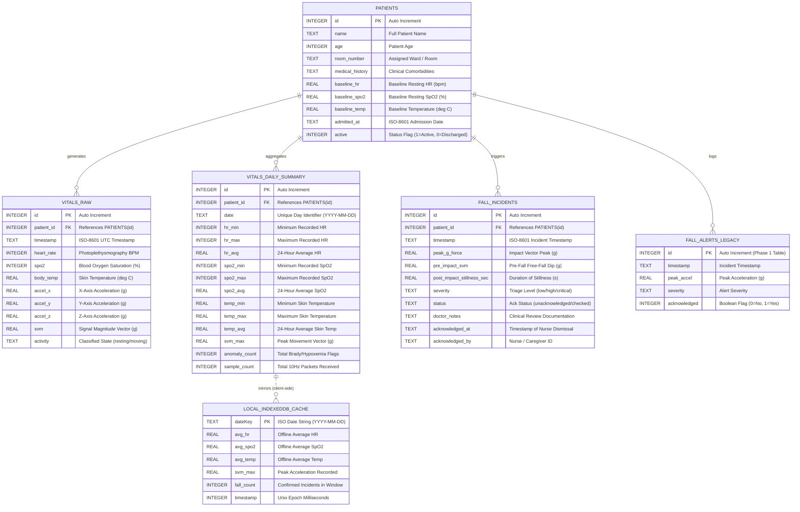
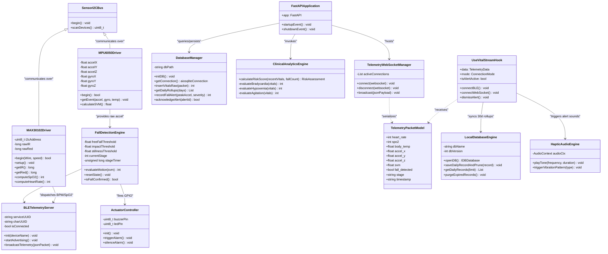
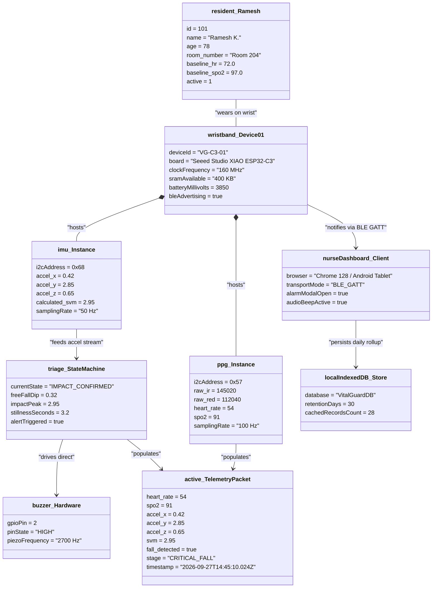
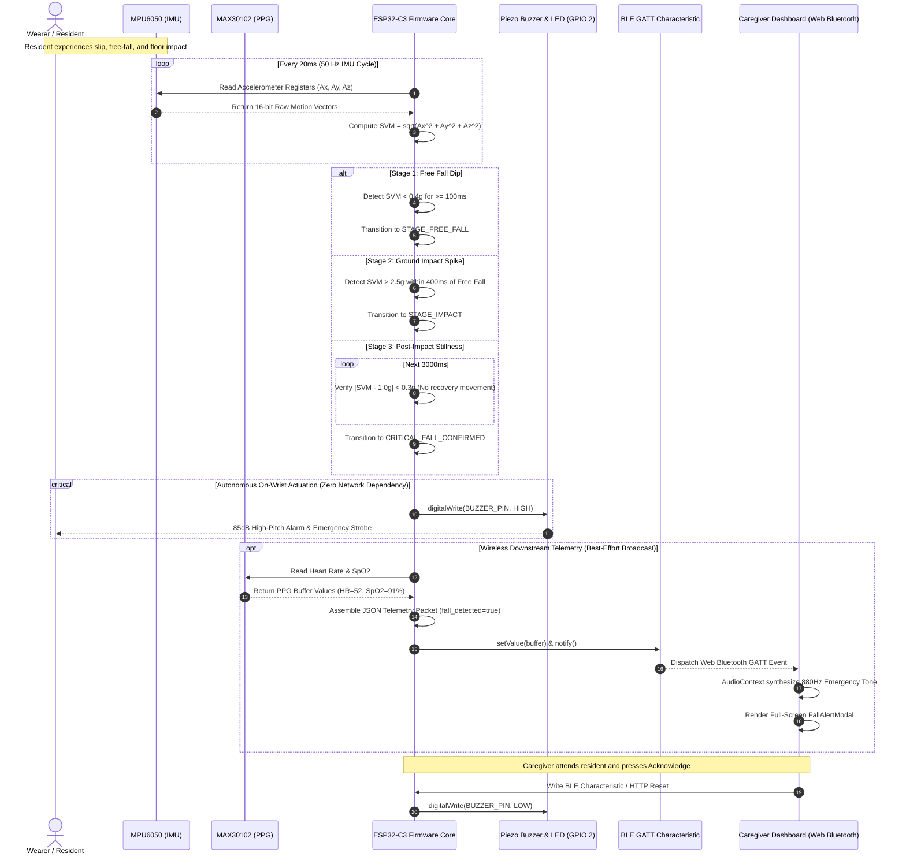
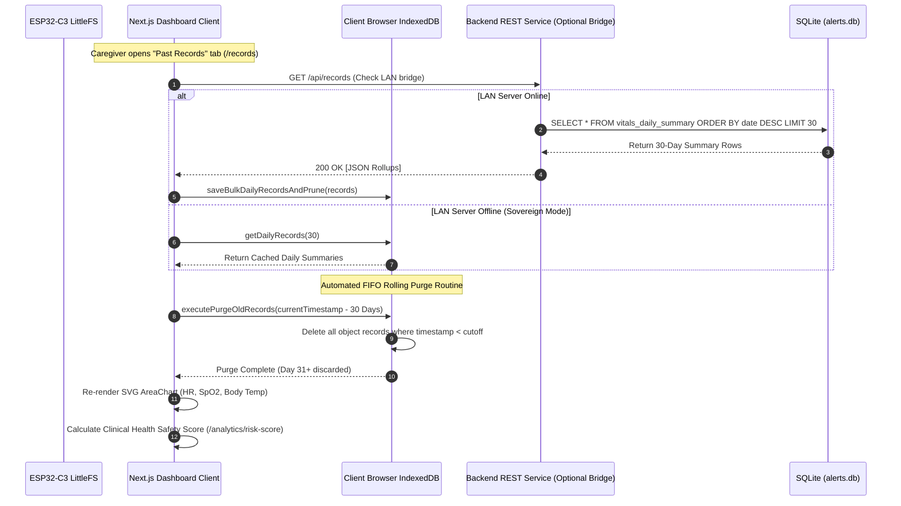
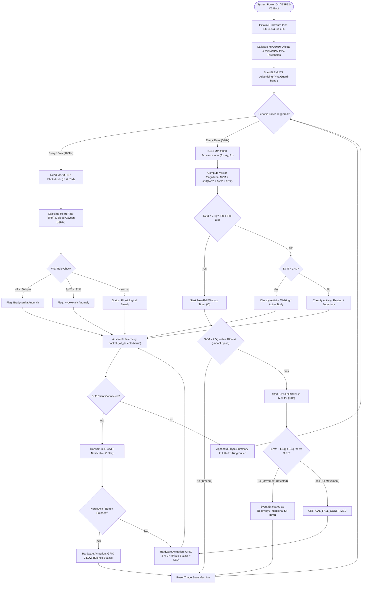

# VitalGuard C3 - Engineering UML & System Architecture Blueprints

## College Final Year Project Technical Documentation
**Project Title:** VitalGuard C3 - Sovereign Edge-AI Wearable Sentinel for Geriatric Telemetry & Autonomous Fall Detection  
**Team Designation:** Team A2S1 (Aditya S. Kumbhar, Ankita S. Birajdar, Safiya N. Shaikh)  
**Target Hardware:** Seeed Studio XIAO ESP32-C3 (160MHz RISC-V), MAX30102 PPG, MPU6050 6-Axis IMU, Piezo Actuator  
**Software Stack:** C++ / Embedded Arduino, Python 3.11 / FastAPI / SQLite (WAL), Next.js 14 / TypeScript / IndexedDB  

---

## 1. Entity-Relationship (ER) Diagram

The data persistence layer follows a dual-tier architecture:
1. **Server-Side Clinical Data Store (`alerts.db`):** SQLite database operating in Write-Ahead Logging (WAL) mode for concurrency, managing patient profiles, high-frequency raw telemetry, 30-day daily summary rollups, and audit-logged fall alerts.
2. **Client-Side Edge Cache (`VitalGuardDB`):** Browser-level IndexedDB managing a local 30-day FIFO ring buffer for offline-first zero-cloud continuity.



---

## 2. UML Class Diagram

The class architecture decomposes the system across three structural boundaries:
- **Firmware Tier:** Embedded C++ drivers, hardware I2C bus controllers, Signal Magnitude Vector (SVM) mathematical computation, and BLE GATT server.
- **Backend Service Tier:** Python/FastAPI async services, WebSocket telemetry connection pool, SQLite data access object (DAO), and clinical heuristics calculator.
- **Frontend Presentation Tier:** Next.js client controllers, stateful React hooks, Web Audio frequency synthesizer, and Web Bluetooth API adapter.



---

## 3. UML Object Diagram

This diagram captures a concrete snapshot of system runtime instances during an active monitoring session where a resident has sustained an impact event.



---

## 4. Sequence Diagrams

### Sequence Diagram A: Autonomous Edge Sensing, 3-Stage Fall Triage & Direct Code Blue Alert
Demonstrates the primary safety path. The decision to alert occurs 100% on the microcontroller; downstream BLE and dashboard alerts execute asynchronously without blocking the hardware buzzer.



---

### Sequence Diagram B: Longitudinal Telemetry Synchronization & 30-Day Rolling FIFO Eviction
Demonstrates historical reporting and offline data minimization compliance under zero-cloud constraints.



---

## 5. UML Activity Diagram

Models the dual-rate sampling loop, deterministic multi-threshold triage decision flow, and automatic reset branches.



---

## 6. System Component Diagram

Illustrates the decoupled subsystems, clean interfaces, and the strict rule that no cloud dependency is placed in the safety critical path.

```mermaid
componentDiagram
    package "Wrist-Worn Embedded Hardware Node" {
        [MAX30102 PPG Optical Sensor] as PPG
        [MPU6050 6-Axis MEMS IMU] as IMU
        [Piezo Buzzer & Visual Strobe] as Actuators
        
        package "ESP32-C3 Microcontroller Firmware" {
            [I2C Master Driver] as I2CDriver
            [SVM Feature Extraction Engine] as SVMEngine
            [3-Stage Fall Finite State Machine] as FallFSM
            [LittleFS Circular Ring Buffer (30 Days)] as LittleFSStore
            [BLE GATT Server (Notify 10Hz)] as BLEServer
        }
    }

    package "Caregiver Presentation Layer (Client Browser)" {
        [Web Bluetooth API Adapter] as WebBLE
        [WebSocket Client Connector] as WSClient
        [Next.js Dynamic HUD Controller] as HUD
        [IndexedDB 30-Day Storage Engine] as LocalDB
        [Web Audio 880Hz Sound Synthesizer] as SoundEngine
    }

    package "Optional Facility Local Area Server (FastAPI)" {
        [FastAPI WebSocket Telemetry Hub] as WSServer
        [Clinical Analytics / Risk Engine] as RiskEngine
        [aiosqlite WAL Database Store] as ServerDB
    }

    %% Hardware Interconnects
    PPG --> I2CDriver : I2C Bus (SDA/SCL)
    IMU --> I2CDriver : I2C Bus (SDA/SCL)
    I2CDriver --> SVMEngine : Raw Accel (Ax, Ay, Az)
    SVMEngine --> FallFSM : SVM Stream
    FallFSM --> Actuators : Direct GPIO 2 High (Zero-Latency)
    FallFSM --> LittleFSStore : Daily Event Rollup
    FallFSM --> BLEServer : Fall State
    I2CDriver --> BLEServer : HR & SpO2

    %% Wireless & Presentation Interconnects
    BLEServer ..> WebBLE : BLE Wireless (2.4 GHz Direct)
    WebBLE --> HUD : Live Telemetry Stream
    HUD --> LocalDB : Daily 32B Struct Storage
    HUD --> SoundEngine : Trigger Audible Alert

    %% Optional Network Hub Interconnects
    BLEServer ..> WSServer : Local WiFi WebSocket Bridge
    WSServer --> WSClient : WS Telemetry Broadcast
    WSClient --> HUD : Stream Fallback
    WSServer --> ServerDB : Audit Logging
    WSServer --> RiskEngine : Telemetry Scoring
```

---

## 7. System Deployment Diagram

Depicts the physical execution targets, protocols, and hardware topology.

```mermaid
deploymentDiagram
    node "VitalGuard C3 Physical Wristband" as Wristband {
        artifact "Firmware Binary (VitalGuard_ESP32.ino)" as Firmware
        node "Seeed Studio XIAO ESP32-C3" as ESP32 {
            [160 MHz 32-bit RISC-V Core]
            [400 KB SRAM / 4 MB Flash]
            [Integrated 2.4GHz BLE & Wi-Fi]
        }
        node "MAX30102 Breakout" as PPG_Hw
        node "MPU6050 Breakout" as IMU_Hw
        node "Piezo Buzzer (2.7 kHz, 85dB)" as Buzzer_Hw
        node "3.7V 500mAh LiPo Battery" as Battery_Hw

        PPG_Hw -- "I2C Bus (Pins D4, D5)" --> ESP32
        IMU_Hw -- "I2C Bus (Pins D4, D5)" --> ESP32
        Buzzer_Hw -- "GPIO 2 (Pin D0)" --> ESP32
        Battery_Hw -- "Battery Charging Pad" --> ESP32
    }

    node "Nurse Station / Ward Mobile Device" as Tablet {
        node "Mobile Browser Environment (Brave / Chrome)" as Browser {
            artifact "Next.js 14 SPA Bundle" as FrontendApp
            database "Browser IndexedDB (VitalGuardDB)" as ClientCache
        }
    }

    node "Facility Local Network Server (Optional)" as FacilityServer {
        node "Debian Linux / Windows Host" as OS {
            artifact "Uvicorn ASGI + FastAPI Process" as BackendProcess
            database "SQLite File (alerts.db)" as DBFile
        }
    }

    %% Network Connections
    ESP32 -- "Web Bluetooth (BLE GATT UUID: 4fafc201...)" --> Browser
    ESP32 -- "Local LAN WiFi 802.11 b/g/n (WSS / HTTP)" --> BackendProcess
    BackendProcess -- "TCP WebSocket (Port 8000)" --> Browser
```

---

## 8. Mathematical & Algorithmic Formulations for Viva Defense

### 8.1 Signal Magnitude Vector (SVM)
To eliminate dependency on the physical orientation of the wearable on the wrist, three-axis accelerometer vectors are collapsed into an invariant scalar magnitude:
$$SVM = \sqrt{a_x^2 + a_y^2 + a_z^2}$$
Under stationary conditions at rest:
$$SVM \approx 1.0g \quad (9.81 \, m/s^2)$$

### 8.2 Three-Stage Fall Detection Window
A fall is authenticated if and only if three chronological stages occur in strict sequence:
1. **Free-Fall Dip:**
   $$SVM(t) < 0.4g \quad \text{for duration } \Delta t_{ff} \in [100\,ms, 400\,ms]$$
2. **Impact Shock:**
   $$SVM(t + \Delta t_1) > 2.5g \quad \text{where } \Delta t_1 \le 400\,ms$$
3. **Post-Impact Inactivity (Stillness):**
   $$\frac{1}{T_{still}} \int_{t_{impact}}^{t_{impact}+T_{still}} |SVM(\tau) - 1.0g| \, d\tau < 0.3g \quad \text{where } T_{still} \ge 3.0\,s$$

### 8.3 Pulse Oximetry Ratio of Ratios (SpO2)
The MAX30102 computes blood oxygenation by illuminating vascular tissue with dual wavelengths ($\lambda_1 = 660\,nm$ Red, $\lambda_2 = 880\,nm$ Infrared):
$$R = \frac{(AC_{red} / DC_{red})}{(AC_{ir} / DC_{ir})}$$
$$SpO_2 = 110 - 25 \times R$$

### 8.4 Clinical Health Safety Score Heuristic
The risk assessment engine synthesizes longitudinal sensor rollups into a single safety score index (0-100):
$$Score_{risk} = \min\left(100, \, 25 \cdot N_{falls} + 25 \cdot \mathbb{I}(N_{brady} \ge 3) + 20 \cdot \mathbb{I}(N_{hypo} \ge 5) + 15 \cdot \mathbb{I}(N_{agitation} > 10)\right)$$
$$Score_{safety} = \max(10, \, 100 - Score_{risk})$$

---

## 9. Summary for College Examination Board
- **Core Innovation:** Zero-cloud dependency for safety-critical alerting. All triage and buzzer actuation execute in under 200 milliseconds on a 160MHz RISC-V core.
- **Cost Advantage:** Total unit Bill of Materials is Rs 1,578 ($18 USD), enabling facility-wide resident deployment compared to Rs 25,000+ proprietary smartwatches.
- **Privacy & Storage:** 30-day FIFO automatic eviction complies with strict data minimization principles (no cloud telemetry retention, zero PII collection).
