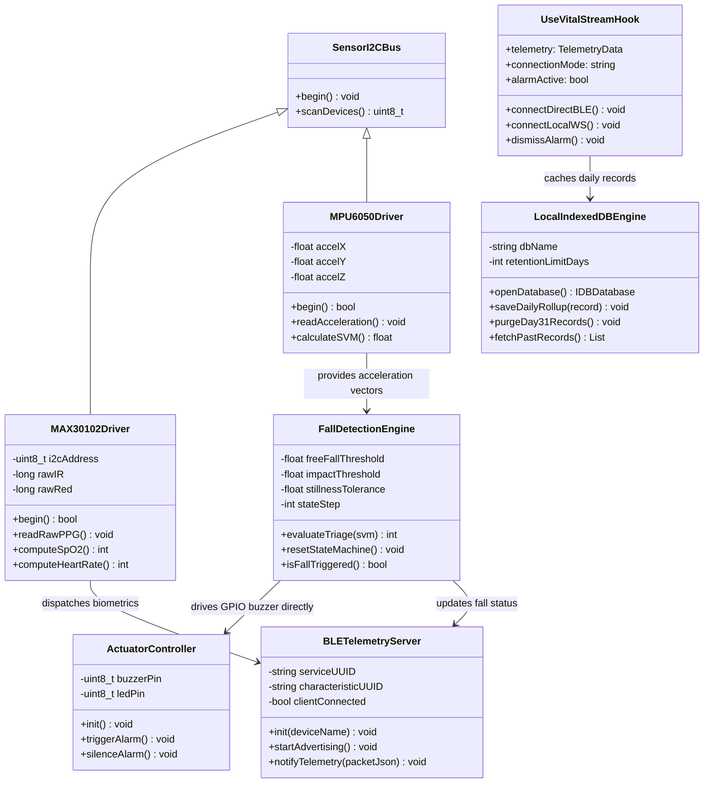
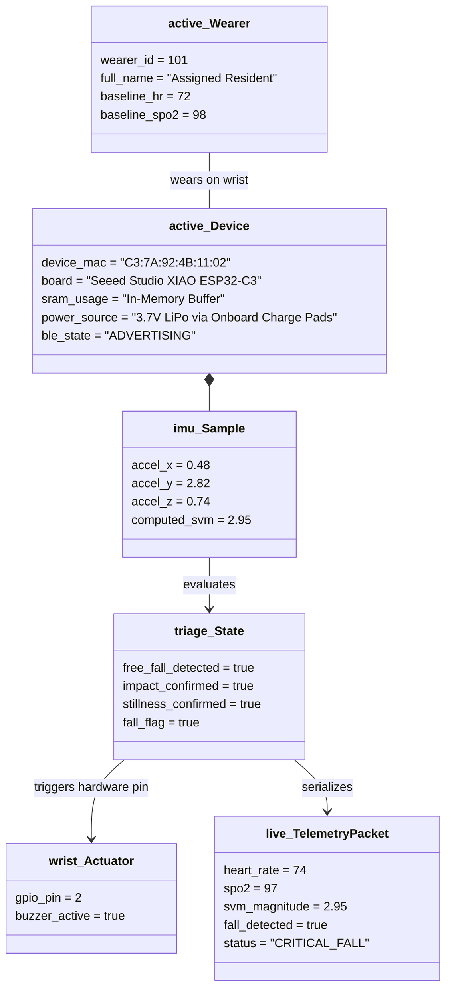
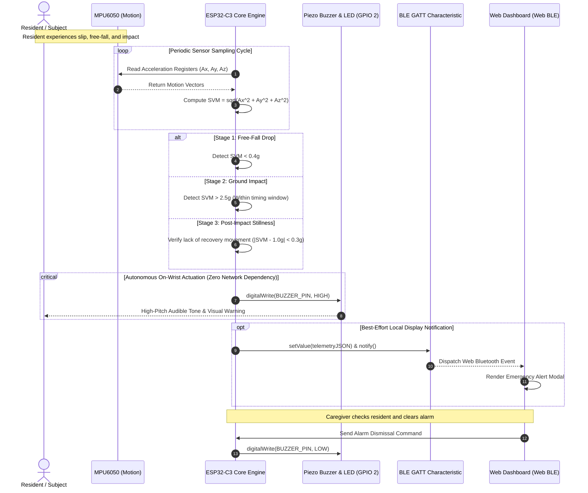
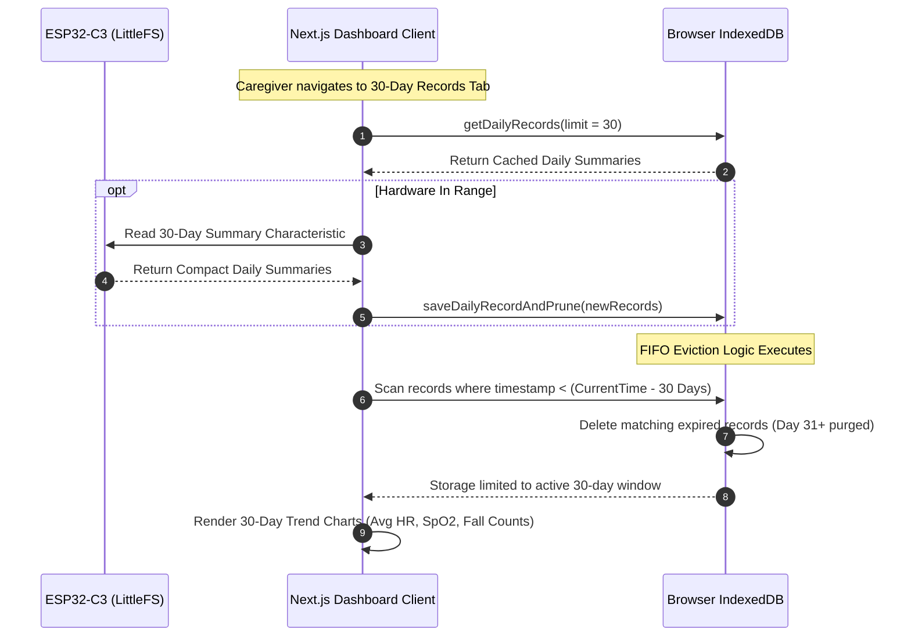
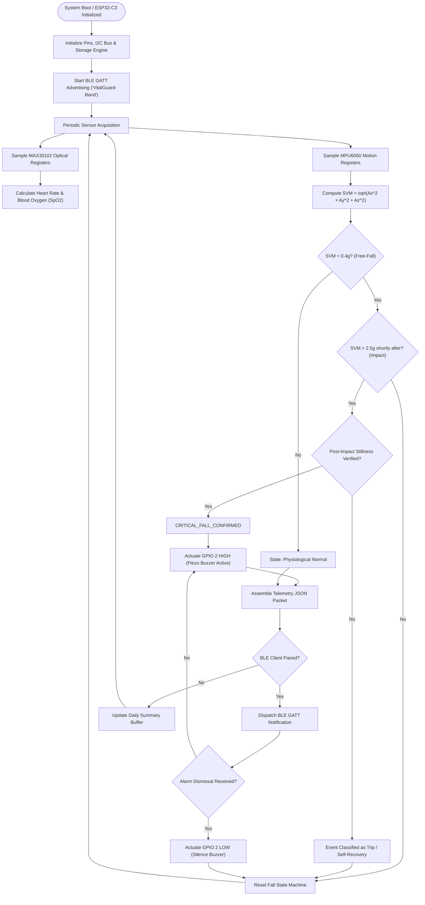
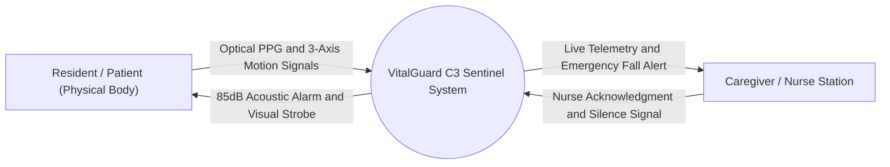
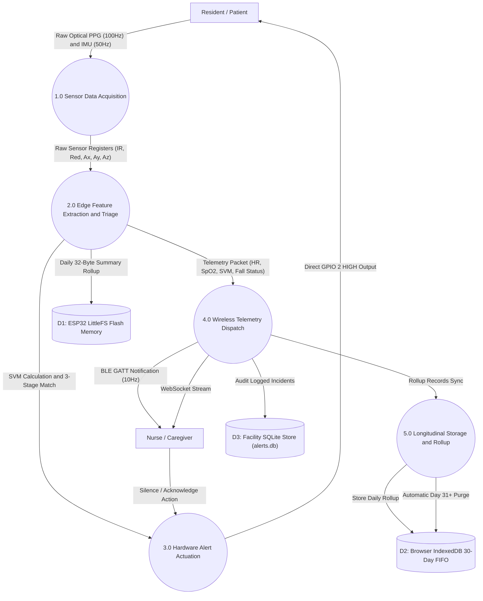

# VitalGuard-C3: Edge-AI Wearable for Elderly Fall Detection & Vitals Monitoring

## Technical System Architecture & Engineering Blueprints
**Project Title:** VitalGuard-C3: Autonomous Fall Detection & Telemetry Band  
**Team Designation:** Team A2S1 (Aditya S. Kumbhar, Ankita S. Birajdar, Safiya N. Shaikh)  
**Target Hardware:** Seeed Studio XIAO ESP32-C3 (160MHz RISC-V), MAX30102 Optical Sensor, MPU6050 6-Axis IMU, Piezo Buzzer & Indicator LED  
**Software Stack:** C++ / Embedded Arduino, Next.js / TypeScript / IndexedDB (Client Cache), Python 3.11 / FastAPI (Optional LAN Bridge)  

---

## 1. Entity-Relationship (ER) Architecture (Chen Notation)

The database persistence layer enforces zero-cloud data sovereignty. Telemetry triage executes entirely on-chip; 30-day historical aggregates are stored in local flash memory and mirrored to browser-level IndexedDB under an automated 30-day First-In, First-Out (FIFO) retention rule.

### 1.1 Structural Chen Element Mapping
The ER model conforms strictly to academic Chen notation standards using all eight foundational symbols:

| Chen Symbol | Architectural Element | Diagram Implementation |
| :--- | :--- | :--- |
| **Rectangle (Single)** | Strong Entity | `WEARER`, `DEVICE`, `GUARDIAN`, `FALL_INCIDENT` |
| **Rectangle (Double)** | Weak Entity | `VITALS_LOG` (Existence-dependent on `DEVICE`) |
| **Diamond (Single)** | Strong Relationship | `MONITORS` (Device-Wearer), `NOTIFIES` (Incident-Guardian) |
| **Diamond (Double)** | Identifying Relationship | `LOGS` (Associates weak entity `VITALS_LOG` to `DEVICE`) |
| **Ellipse (Solid)** | Standard Attribute | `full_name`, `contact_phone`, `baseline_hr`, `battery_level` |
| **Ellipse (Underlined)** | Primary Key Attribute | `<u>wearer_id</u>`, `<u>device_mac</u>`, `<u>guardian_id</u>`, `<u>incident_id</u>` |
| **Ellipse (Double)** | Multi-Valued Attribute | `emergency_contacts` (Wearer can have secondary contact numbers) |
| **Ellipse (Dashed)** | Derived Attribute | `- - svm_magnitude - -` (Computed on-chip: $\sqrt{a_x^2 + a_y^2 + a_z^2}$) |

### 1.2 ER Model Reference
The complete graphical Chen diagram is compiled in `VitalGuard_ER_Diagram.png`.

```text
       [ GUARDIAN ] <========== (1:N) ========== { NOTIFIES }
            │                                           │
            │ (1:N)                                     │ (M:N)
            ▼                                           ▼
       [  WEARER  ] <========== (1:1) ========== { MONITORS }
                                                        ▲
                                                        │ (1:1)
                                                        ▼
       [[ VITALS_LOG ]] <==== (N:1) ===== {{ LOGS }} == [ DEVICE ]
                                                        │
                                                        │ (1:N)
                                                        ▼
                                                 [ FALL_INCIDENT ]
```

---

## 2. UML Class Diagram



---

## 3. UML Object Diagram (Runtime Impact Snapshot)



---

## 4. Sequence Diagrams

### Sequence Diagram A: Autonomous Edge Triage & Code Blue Alert
The safety-critical alert path executes 100% on the microcontroller. The physical alarm buzzer never waits for network or Bluetooth connectivity.



---

### Sequence Diagram B: 30-Day Rolling Storage & Day 31 Eviction



---

## 5. UML Activity Diagram



---

## 6. System Component Diagram

```mermaid
componentDiagram
    package "VitalGuard-C3 Hardware Sentinel" {
        [MAX30102 Optical Sensor] as PPG
        [MPU6050 Motion Sensor] as IMU
        [Piezo Buzzer & LED] as Actuator

        package "ESP32-C3 Firmware Core" {
            [I2C Hardware Controller] as I2CDriver
            [SVM Math Engine] as SVMEngine
            [3-Stage Fall State Machine] as FallFSM
            [LittleFS Storage Engine] as StorageEngine
            [BLE GATT Server] as BLECore
        }
    }

    package "Client Presentation Layer (Mobile WebApp)" {
        [Web Bluetooth Adapter] as WebBLE
        [Real-Time HUD Dashboard] as LiveHUD
        [IndexedDB 30-Day Storage] as BrowserCache
        [Web Audio Synthesizer] as SoundAlert
    }

    package "Optional LAN Bridge (Development/Demo)" {
        [FastAPI Telemetry Hub] as MockServer
        [Local SQLite Event Log] as LocalDB
    }

    PPG --> I2CDriver : I2C Bus (SDA/SCL)
    IMU --> I2CDriver : I2C Bus (SDA/SCL)
    I2CDriver --> SVMEngine : Acceleration Vectors
    SVMEngine --> FallFSM : Scalar SVM Stream
    FallFSM --> Actuator : Direct GPIO High Signal
    FallFSM --> StorageEngine : Daily Summary Write
    FallFSM --> BLECore : Fall Alert Flag
    I2CDriver --> BLECore : Filtered Biometrics

    BLECore ..> WebBLE : Direct BLE Radio Stream
    WebBLE --> LiveHUD : Live Telemetry Hook
    LiveHUD --> BrowserCache : Daily Rollup Records
    LiveHUD --> SoundAlert : Audible Warning

    MockServer ..> LiveHUD : Local WebSocket Bridge
    MockServer --> LocalDB : Development Database Log
```

---

## 7. System Deployment Diagram

```mermaid
deploymentDiagram
    node "VitalGuard-C3 Physical Wristband" as Wristband {
        artifact "Firmware Binary (C++ / Arduino)" as Firmware
        node "Seeed Studio XIAO ESP32-C3" as Microcontroller {
            [160 MHz RISC-V Processor]
            [400 KB SRAM / 4 MB Flash]
            [Integrated 2.4 GHz BLE Antenna]
            [Onboard LiPo Charge Management]
        }
        node "MAX30102 PPG Breakout" as PPG_Hw
        node "MPU6050 IMU Breakout" as IMU_Hw
        node "Piezo Buzzer & LED" as Buzzer_Hw
        node "3.7V 500mAh LiPo Cell" as Battery_Hw

        PPG_Hw -- "I2C (SDA/SCL)" --> Microcontroller
        IMU_Hw -- "I2C (SDA/SCL)" --> Microcontroller
        Buzzer_Hw -- "GPIO 2" --> Microcontroller
        Battery_Hw -- "Underside Solder Pads" --> Microcontroller
    }

    node "Caregiver Mobile Device" as MobileDevice {
        node "Mobile Browser (Chrome / Bluefy)" as BrowserEngine {
            artifact "Next.js Mobile WebApp" as WebClient
            database "Browser IndexedDB (VitalGuardDB)" as LocalIndexedDB
        }
    }

    node "Optional Local Workstation (Demo Bridge)" as LaptopWorkstation {
        node "Python Runtime Environment" as PythonEnv {
            artifact "FastAPI Mock Bridge (Uvicorn)" as BackendProcess
            database "Local SQLite Database (alerts.db)" as DBStore
        }
    }

    Microcontroller -- "Direct Web Bluetooth (BLE GATT)" --> WebClient
    BackendProcess -- "Local WebSocket (ws://...)" --> WebClient
```

---

## 8. Mathematical Formulations for Viva Defense

### 8.1 Signal Magnitude Vector (SVM)
To make fall detection invariant to wrist rotation or hand orientation, three-axis accelerometer vectors are collapsed into an invariant scalar magnitude:
$$SVM = \sqrt{a_x^2 + a_y^2 + a_z^2}$$
Under stationary conditions at rest:
$$SVM \approx 1.0g \quad (9.81 \, m/s^2)$$

### 8.2 Three-Stage Fall Detection Pipeline
A fall event is authenticated if and only if three chronological motion phases occur in sequence:
1. **Free-Fall Dip:**
   $$SVM(t) < 0.4g \quad \text{during transition window } \Delta t_{ff}$$
2. **Impact Shock Spike:**
   $$SVM(t + \Delta t_1) > 2.5g \quad \text{where } \Delta t_1 \text{ immediately follows free-fall}$$
3. **Post-Impact Inactivity (Stillness):**
   $$|SVM(\tau) - 1.0g| < 0.3g \quad \text{verified over stationary dwell period } T_{still}$$

### 8.3 Pulse Oximetry Ratio of Wavelengths (SpO2)
Capillary blood oxygen saturation is derived by comparing absorption under red ($\lambda_1 = 660\,nm$) and infrared ($\lambda_2 = 880\,nm$) light:
$$R = \frac{(AC_{red} / DC_{red})}{(AC_{ir} / DC_{ir})}$$
$$SpO_2 = 110 - 25 \times R$$

### 8.4 Daily Physical Stability Index
Longitudinal stability is computed using daily aggregated event summaries:
$$StabilityIndex = \max\left(0, \, 100 - (30 \times N_{falls}) - AnomalyPenalty\right)$$

---

## 9. Examination Defense Key Points
* **Zero Cloud Latency:** The primary safety-critical alert path executes directly on the RISC-V microcontroller to trigger the physical buzzer without network negotiation.
* **Autonomous Power Design:** The Seeed Studio XIAO ESP32-C3 uses its integrated charge controller and underside solder pads to manage the 3.7V LiPo cell, eliminating external charging IC modules.
* **Data Minimization:** No raw biometric data leaves the device; only 30 days of compact daily summaries are retained, with Day 31 automatically evicted via a strict rolling FIFO cache.
* **Low Unit Cost:** The bill of materials totals approximately Rs 1,500 to Rs 2,500, offering a dedicated, non-intrusive alternative to commercial smartwatches for elderly safety monitoring.

---

## 10. Data Flow Diagram (DFD)

### 10.1 DFD Level 0 (Context Level Diagram)
Defines the external entity interactions and system boundary.



### 10.2 DFD Level 1 (Decomposed Functional Data Flow)
Maps data movement between sub-processes, data stores, and external entities.



---

## 11. System Process Flowchart

Models detailed sequential execution, decision diamonds, and interrupt handlers from power-on through normal monitoring and alert loops.

```mermaid
flowchart TD
    Boot(["Power On / Hardware Reset"]) --> SetupHardware["Setup GPIO 2, Serial at 115200, I2C Bus at 400kHz"]
    SetupHardware --> InitSensors["Initialize MAX30102 and MPU6050 Sensors"]
    InitSensors --> CheckSensors{"Sensors Responding on I2C?"}
    CheckSensors -- "No" --> LogError["Log I2C Bus Error and Retry Scan"]
    LogError --> InitSensors
    CheckSensors -- "Yes" --> InitBLE["Initialize BLE Stack ('VitalGuard-Band') and LittleFS"]
    InitBLE --> StartAdvertising["Start BLE Advertising on Service 4fafc201..."]

    StartAdvertising --> MainLoop["Enter Main Operational Loop"]
    MainLoop --> ReadSensors["Acquire Sample: MPU6050 (Ax, Ay, Az) and MAX30102 (IR, Red)"]
    ReadSensors --> VectorMath["Compute Signal Magnitude Vector: SVM = sqrt(Ax^2 + Ay^2 + Az^2)"]
    ReadSensors --> PPGMath["Extract Pulse Peaks: Compute HR (BPM) and SpO2 (%)"]

    VectorMath --> CheckFreeFall{"SVM < 0.4g? (Free-Fall Dip)"}
    CheckFreeFall -- "Yes" --> MarkFreeFall["Record Free-Fall Timestamp t_ff"]
    MarkFreeFall --> CheckImpact{"SVM > 2.5g within 400ms? (Impact Shock)"}
    CheckFreeFall -- "No" --> CheckVitals{"Vital Anomaly? (HR < 50 or SpO2 < 92%)"}

    CheckImpact -- "No (Timeout)" --> ResetTriage["Clear Triage State"]
    CheckImpact -- "Yes" --> MonitorStillness["Sample Next 3000ms: Monitor Post-Impact Acceleration"]
    MonitorStillness --> CheckStillness{"|SVM - 1.0g| < 0.3g for >= 3.0s?"}

    CheckStillness -- "No (Recovery Motion)" --> ResetTriage
    CheckStillness -- "Yes (Stillness Confirmed)" --> TriggerFall["Assert CRITICAL_FALL_CONFIRMED"]

    TriggerFall --> AlarmActuation["Hardware Override: Write GPIO 2 HIGH (Buzzer and Strobe Active)"]
    CheckVitals -- "Yes" --> FlagAnomaly["Flag Bradycardia / Hypoxemia Warning"]
    CheckVitals -- "No" --> NormalState["Status: Normal / Sedentary or Active"]

    AlarmActuation --> BuildPacket["Format 180-Byte JSON Telemetry Payload"]
    FlagAnomaly --> BuildPacket
    NormalState --> BuildPacket
    ResetTriage --> BuildPacket

    BuildPacket --> CheckBLE{"BLE Client Connected?"}
    CheckBLE -- "Yes" --> SendBLE["Transmit BLE GATT Characteristic Notification (10Hz)"]
    CheckBLE -- "No" --> CheckWS{"LAN WebSocket Active?"}
    CheckWS -- "Yes" --> SendWS["Broadcast Payload to Connected WebSockets"]
    CheckWS -- "No" --> RollupCheck{"24-Hour Cycle Complete?"}
    SendBLE --> CheckAck{"Caregiver Silence / Reset Received?"}
    SendWS --> CheckAck

    CheckAck -- "Yes" --> SilenceAlarm["Write GPIO 2 LOW and Reset State Machine"]
    CheckAck -- "No" --> AlarmActuation
    SilenceAlarm --> RollupCheck

    RollupCheck -- "Yes" --> WriteRollup["Commit 32-Byte Daily Summary to LittleFS and IndexedDB"]
    WriteRollup --> PurgeOld["Purge Records Older Than 30 Days"]
    RollupCheck -- "No" --> LoopDelay["Delay 100ms (10Hz Sample Interval)"]
    PurgeOld --> LoopDelay
    LoopDelay --> MainLoop
```


