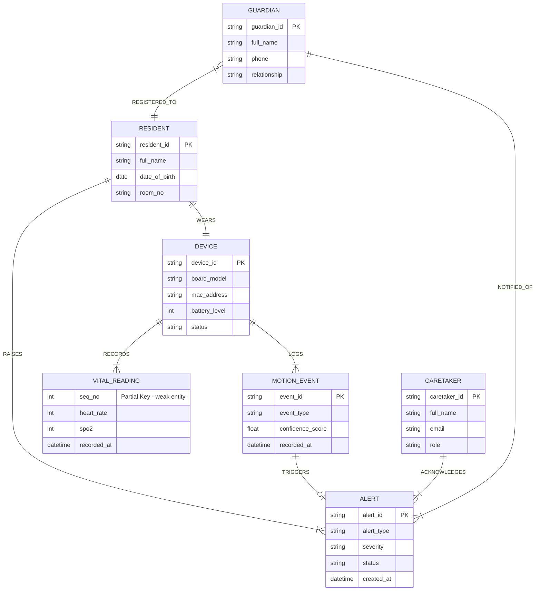
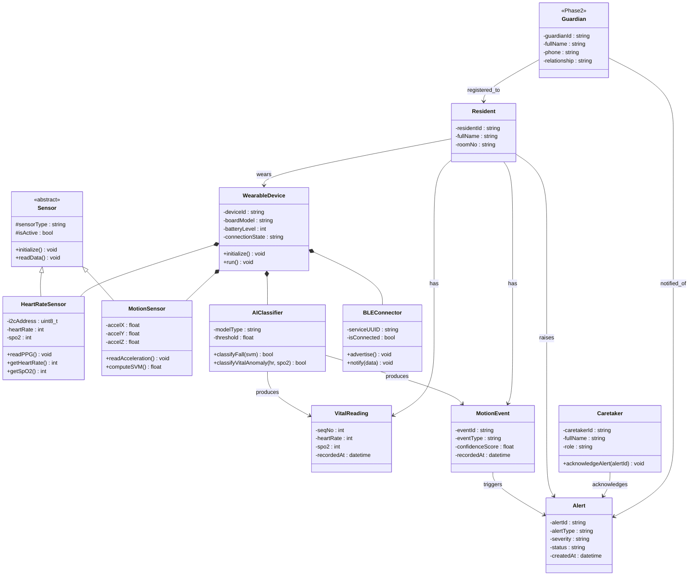
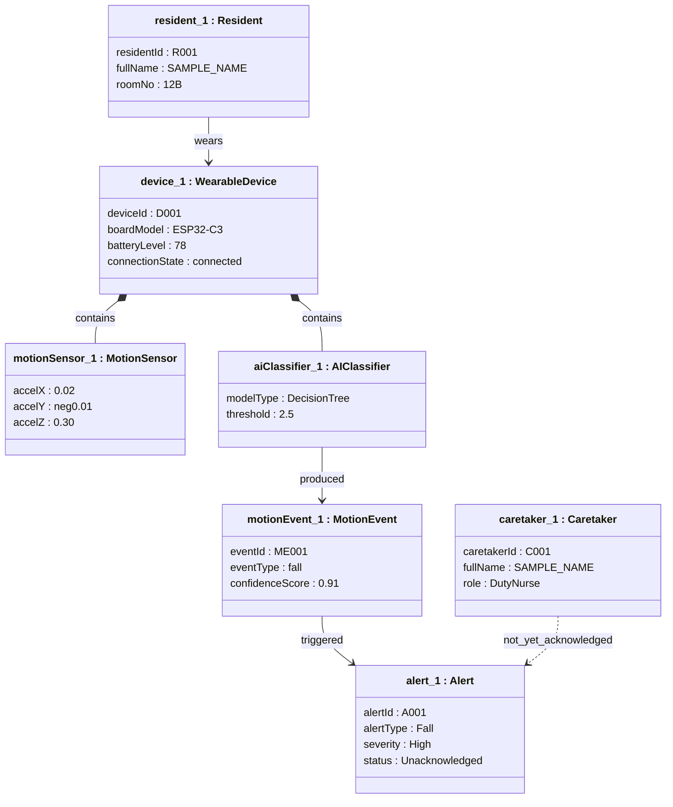
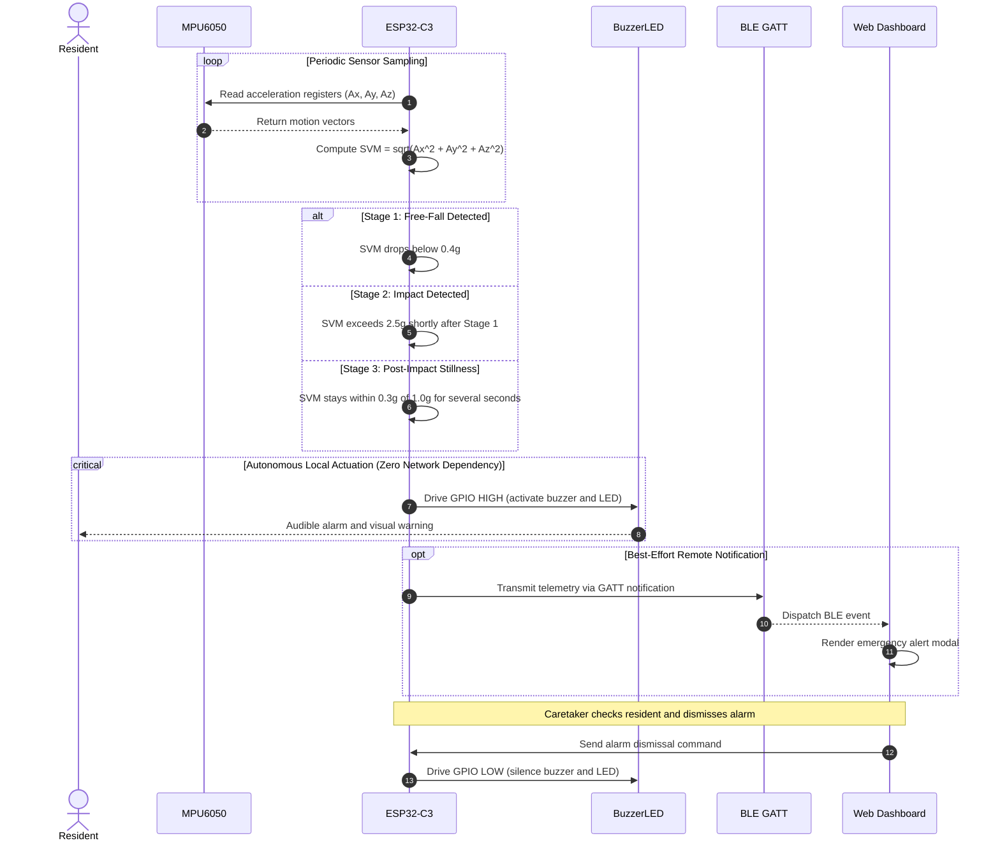
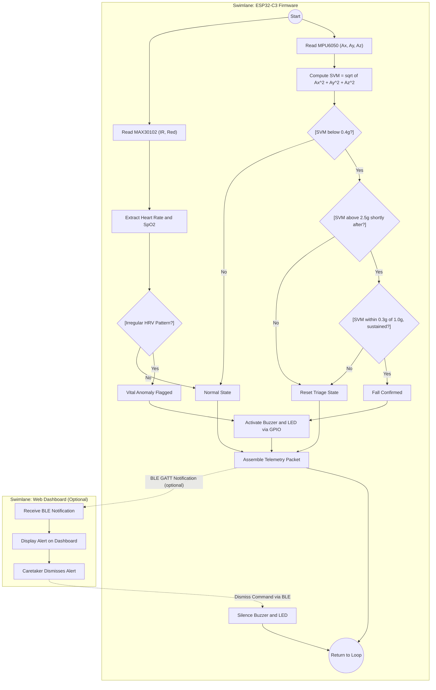
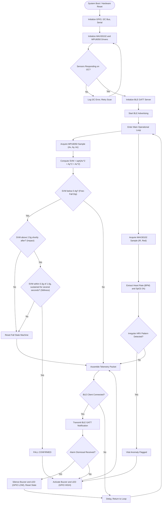
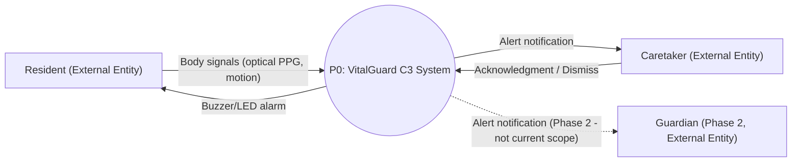
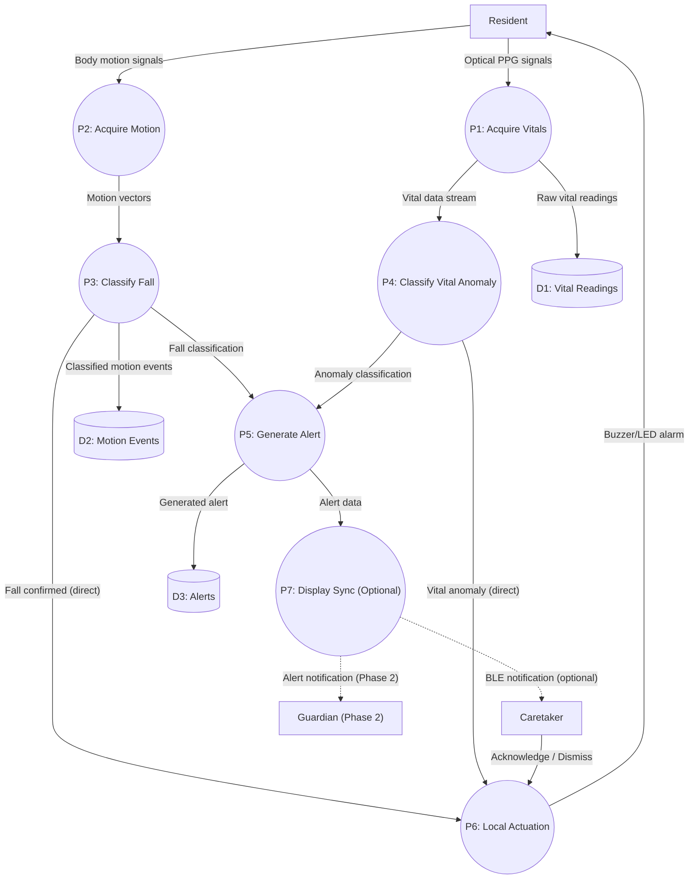

# VitalGuard C3 - Engineering Diagrams

**Project:** VitalGuard C3
**Team:** [TEAM_MEMBERS_PENDING_CONFIRMATION]
**Target Hardware:** ESP32-C3 [BOARD_NAME_PENDING], MAX30102 (I2C), MPU6050 (I2C, shared bus), Piezo Buzzer + LED (direct GPIO)
**Power:** 3.7V LiPo battery, charged via the board's own built-in charging circuit

---

## 1. Entity-Relationship (ER) Diagram

This diagram defines the seven data entities, their attributes, and the relationships between them using Chen notation.

> **Notation Disclosure:** Mermaid.js does not support true Chen ER notation. The following required Chen symbols cannot be rendered natively in Mermaid:
> - **Double-outline rectangle** for weak entity (VITAL_READING)
> - **Double-outline ellipse** for multi-valued attributes (guardian_contact, phone)
> - **Dashed-outline ellipse** for derived attribute (age)
> - **Dashed-underlined text** for partial key (seq_no)
> - **Double-outline diamond** for identifying relationship (RECORDS)
> - **Double line** for total participation (DEVICE-RECORDS-VITAL_READING, DEVICE-LOGS-MOTION_EVENT)
>
> The canonical Chen model is therefore described structurally in text below. A supplementary Mermaid erDiagram in **crow's-foot notation (not Chen)** is included afterward for machine-renderable reference only.

### Chen Notation Structural Description

**Entities**

| Entity | Shape | Type |
|:---|:---|:---|
| RESIDENT | Single Rectangle | Strong Entity |
| CARETAKER | Single Rectangle | Strong Entity |
| DEVICE | Single Rectangle | Strong Entity |
| VITAL_READING | Double Rectangle | Weak Entity (existence-dependent on DEVICE) |
| MOTION_EVENT | Single Rectangle | Strong Entity |
| ALERT | Single Rectangle | Strong Entity |
| GUARDIAN | Single Rectangle | Strong Entity (Phase 2 - Not Current Scope) |

**RESIDENT Attributes**
- `resident_id` - Ellipse, underlined (Primary Key)
- `full_name` - Ellipse
- `date_of_birth` - Ellipse
- `age` - Dashed-outline Ellipse (Derived from date_of_birth)
- `guardian_contact` - Double Ellipse (Multi-Valued)
- `room_no` - Ellipse

**CARETAKER Attributes**
- `caretaker_id` - Ellipse, underlined (Primary Key)
- `full_name` - Ellipse
- `email` - Ellipse
- `phone` - Double Ellipse (Multi-Valued)
- `role` - Ellipse

**DEVICE Attributes**
- `device_id` - Ellipse, underlined (Primary Key)
- `board_model` - Ellipse
- `mac_address` - Ellipse
- `battery_level` - Ellipse
- `status` - Ellipse

**VITAL_READING Attributes** (Weak Entity)
- `seq_no` - Ellipse, dashed-underlined (Partial Key)
- `heart_rate` - Ellipse
- `spo2` - Ellipse
- `recorded_at` - Ellipse

**MOTION_EVENT Attributes**
- `event_id` - Ellipse, underlined (Primary Key)
- `event_type` - Ellipse
- `confidence_score` - Ellipse
- `recorded_at` - Ellipse

**ALERT Attributes**
- `alert_id` - Ellipse, underlined (Primary Key)
- `alert_type` - Ellipse
- `severity` - Ellipse
- `status` - Ellipse
- `created_at` - Ellipse

**GUARDIAN Attributes** (Phase 2 - Not Current Scope)
- `guardian_id` - Ellipse, underlined (Primary Key)
- `full_name` - Ellipse
- `phone` - Ellipse
- `relationship` - Ellipse

**Relationships**

| Relationship | Diamond Shape | From | To | Cardinality | Participation |
|:---|:---|:---|:---|:---|:---|
| WEARS | Single Diamond | RESIDENT | DEVICE | 1 : 1 | Partial (Single Line) |
| RECORDS | Double Diamond (Identifying) | DEVICE | VITAL_READING | 1 : M | Total (Double Line) |
| LOGS | Single Diamond | DEVICE | MOTION_EVENT | 1 : M | Total (Double Line) |
| RAISES | Single Diamond | RESIDENT | ALERT | 1 : M | Partial (Single Line) |
| TRIGGERS | Single Diamond | MOTION_EVENT | ALERT | 1 : 0..1 | Partial (Single Line) |
| ACKNOWLEDGES | Single Diamond | CARETAKER | ALERT | 1 : M | Partial (Single Line) |
| REGISTERED_TO | Single Diamond | GUARDIAN | RESIDENT | M : 1 | Partial (Single Line) |
| NOTIFIED_OF | Single Diamond | GUARDIAN | ALERT | 1 : M | Partial (Single Line) |

### Supplementary Reference (Crow's-Foot Notation - NOT Chen)

> This Mermaid block uses crow's-foot notation for quick visual reference. It does **not** represent Chen notation and cannot express multi-valued attributes, derived attributes, partial keys, weak entities, identifying relationships, or total participation lines documented above.

---

## 2. Class Diagram

This diagram defines the software class hierarchy with inheritance, composition, and association relationships.

---

## 3. Object Diagram (Runtime Snapshot)

This diagram shows concrete object instances at a specific moment in time: a fall has been detected and an alert is pending acknowledgment.

> **Notation Note:** Mermaid does not have a dedicated object diagram type. The classDiagram syntax is used here with stereotype annotations to represent named object instances.

---

## 4. Sequence Diagram (Fall Detection and Alert Path)

This diagram traces the message flow during a fall event, from sensor sampling through autonomous on-device actuation and optional remote notification.

---

## 5. Activity Diagram

This diagram models the system's operational workflow split across two swimlanes, distinguishing on-device logic from optional network-dependent display.

> **Notation Disclosure:** Mermaid.js does not support native UML activity diagram elements (filled-circle initial/final nodes, fork/join bars, or formal swimlane partitions). Subgraphs are used to approximate swimlanes, and standard flowchart shapes substitute for UML activity notation elements.

---

## 6. System Flowchart

This diagram models the detailed sequential execution from power-on through normal monitoring and the three-stage fall detection loop.

---

## 7. Data Flow Diagram (DFD)

### 7.1 DFD Level 0 (Context Diagram)

This diagram defines the system boundary and interactions with external entities.

> **Notation Note:** Traditional DFD uses circles for processes, open-ended rectangles for data stores, and squares for external entities. Mermaid does not have a native DFD diagram type; the flowchart syntax is used here with circles for the process and rectangles for external entities as an approximation.

### 7.2 DFD Level 1 (Functional Decomposition)

This diagram maps data movement between sub-processes, data stores, and external entities.

> **Critical Design Rule:** P6 (Local Actuation) receives direct data flows from P3 and P4 with zero dependency on P5 or P7. P7 (Display Sync) is a separate, parallel, optional branch. This enforces the same zero-network-dependency principle documented in the Sequence Diagram and Flowchart above.

### DFD Level 1 Process Descriptions

| Process | Input | Output | Description |
|:---|:---|:---|:---|
| P1: Acquire Vitals | Optical PPG signals from MAX30102 | Raw vital readings (HR, SpO2) | Reads MAX30102 I2C registers and extracts heart rate and blood oxygen values |
| P2: Acquire Motion | Body motion from MPU6050 | Raw acceleration vectors (Ax, Ay, Az) | Reads MPU6050 I2C registers for 3-axis acceleration data |
| P3: Classify Fall | Motion vectors from P2 | Fall classification, motion event record | Runs 3-stage SVM check: free-fall (below 0.4g), impact (above 2.5g), stillness (within 0.3g of 1.0g) |
| P4: Classify Vital Anomaly | Vital data from P1 | Anomaly classification | Detects irregular patterns via HRV features (separate from fall detection, never fused) |
| P5: Generate Alert | Classifications from P3 and P4 | Alert record | Creates and stores an alert entry with type, severity, and status |
| P6: Local Actuation | Direct signal from P3 or P4, dismiss from Caretaker | Buzzer/LED output | Drives GPIO to activate or silence the on-wrist alarm. Has zero dependency on P5 or P7 |
| P7: Display Sync (Optional) | Alert data from P5 | BLE notification | Transmits alert to connected web dashboard via BLE GATT. Entirely optional, not part of safety-critical path |
