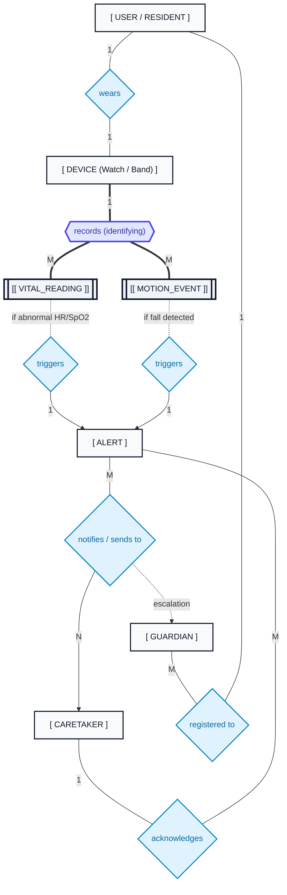
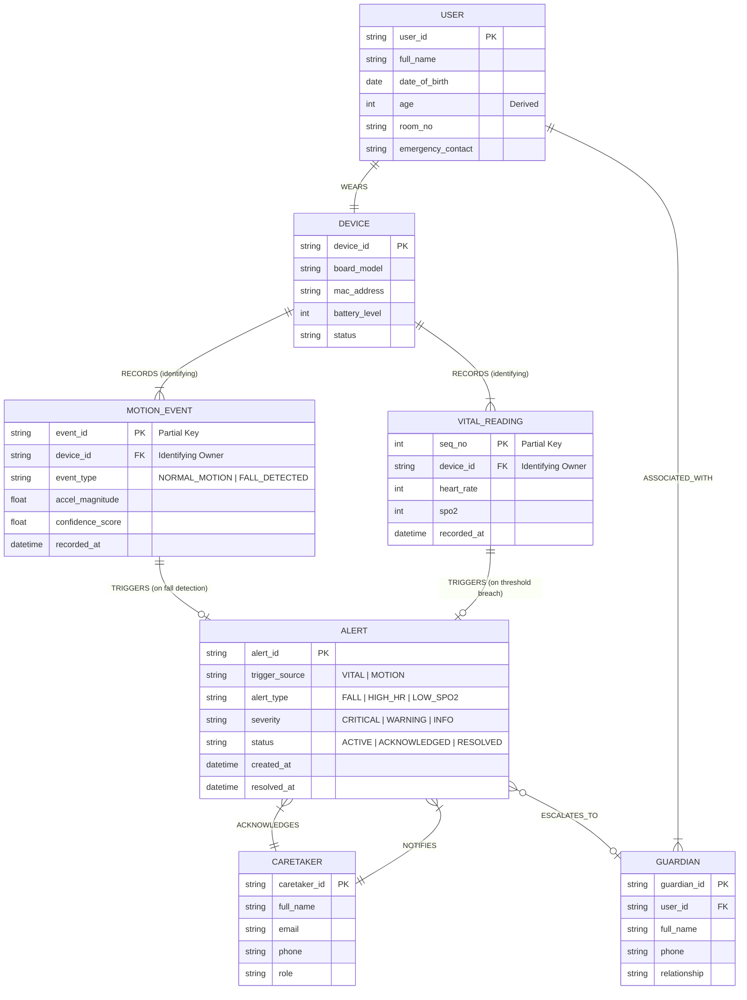
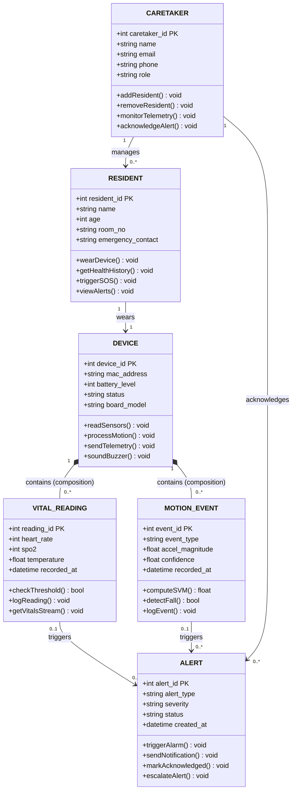
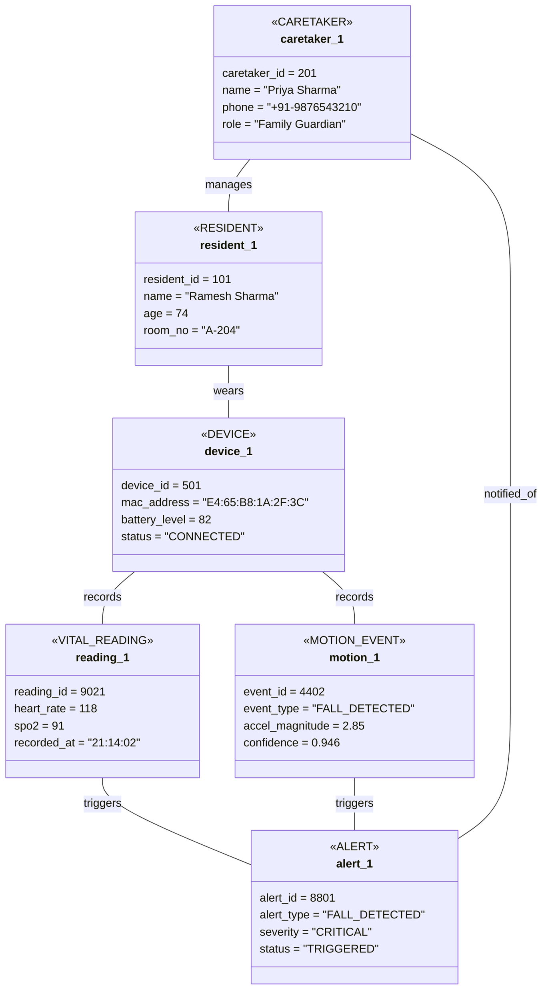
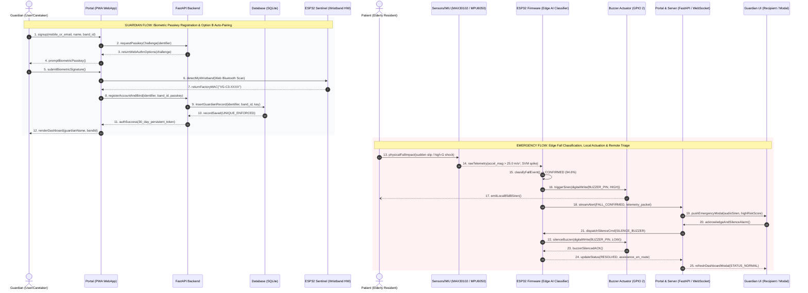
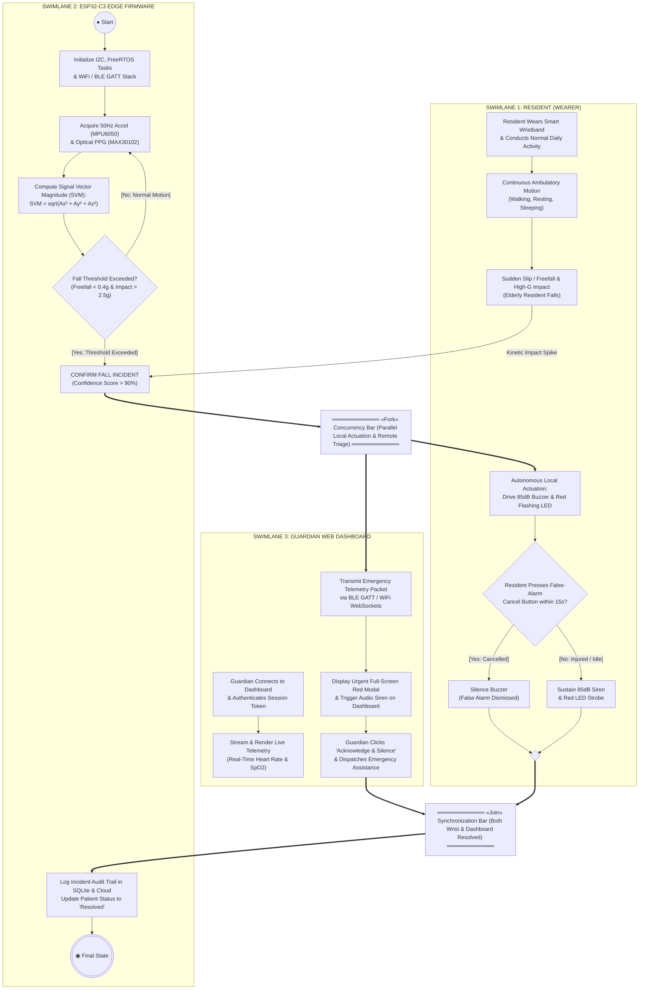
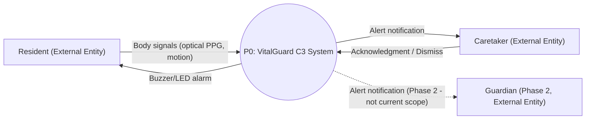
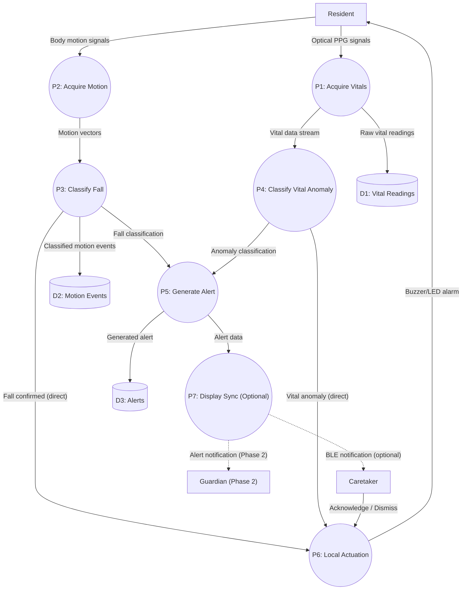
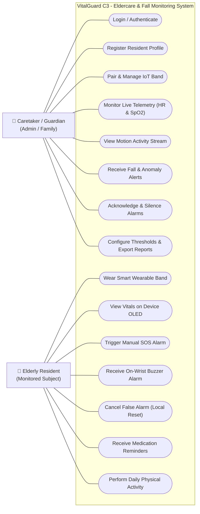
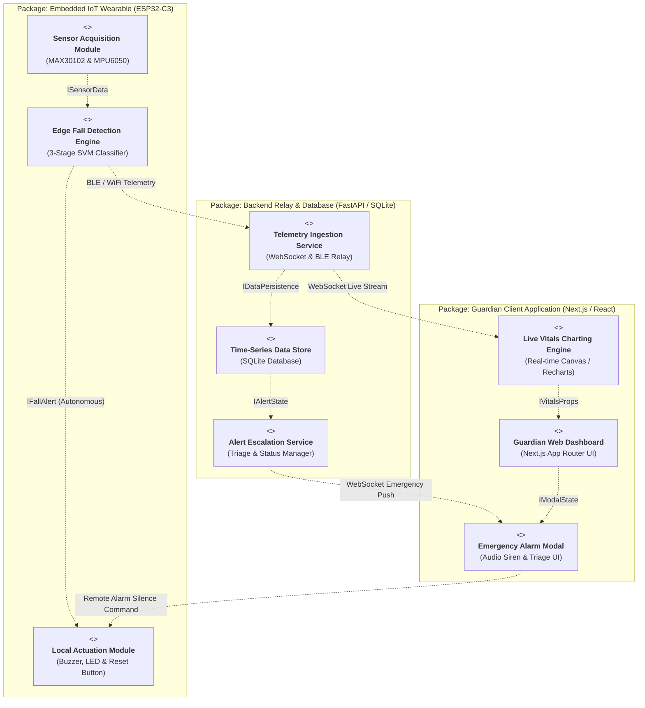

# VitalGuard C3 - Engineering Diagrams

**Project:** VitalGuard C3
**Team:** [TEAM_MEMBERS_PENDING_CONFIRMATION]
**Target Hardware:** ESP32-C3 [BOARD_NAME_PENDING], MAX30102 (I2C), MPU6050 (I2C, shared bus), Piezo Buzzer + LED (direct GPIO)
**Power:** 3.7V LiPo battery, charged via the board's own built-in charging circuit

---

## 1. Entity-Relationship (ER) Diagram

This section defines the data architecture, entity specifications, and cardinalities aligned with both academic **Chen Notation** (for theoretical schema defense) and **Relational Crow's-Foot Notation** (for database implementation).

> **Vector Asset:** Vector SVG source available at [VitalGuard_Chen_ER.svg](file:///c:/Users/hp/Desktop/NXT/Vital-C3/VitalGuard_Chen_ER.svg). Ultra-high resolution 300 DPI raster available at [VitalGuard_Chen_ER.png](file:///c:/Users/hp/Desktop/NXT/Vital-C3/VitalGuard_Chen_ER.png).

---

### Conceptual Architecture & Academic Evaluation

Based on the hand-drawn system design:
1. **User Wearable Binding (`USER` — `WEARS` — `DEVICE`)**:
   - A 1:1 relationship between an elderly resident/user and their assigned IoT wearable device (ESP32-C3 band/watch).
2. **Identifying Weak Relationship (`DEVICE` — `RECORDS` — `VITAL_READING` & `MOTION_EVENT`)**:
   - Both continuous vital telemetry (Heart Rate, SpO2) and motion telemetry (MPU6050 accelerometer events) cannot exist independently of the generating hardware device.
   - In Chen notation, `RECORDS` is an **identifying relationship (Double Diamond)**, and both `VITAL_READING` and `MOTION_EVENT` are **Weak Entities (Double Rectangles)** with partial discriminators (`seq_no` / `timestamp`).
3. **Event Anomaly Detection (`TRIGGERS` — `ALERT`)**:
   - **Normal Motion vs Fall Detection**: Normal motion telemetry is stored as continuous time-series logs. Only when the motion classification engine detects a fall (`event_type == 'FALL_DETECTED'`) or vital threshold breaches (tachycardia/hypoxia) is an `ALERT` entity instantiated via the `TRIGGERS` relationship (cardinality `0..1`).
4. **Caretaker / Guardian Escalation (`ALERT` — `NOTIFIES` / `ACKNOWLEDGES` — `CARETAKER`)**:
   - Once an emergency alert is triggered, it is dispatched to the Caretaker / Guardian dashboard and devices. The caretaker performs an `ACKNOWLEDGES` transaction, logging the resolution timestamp and status.

---

### Chen Notation Structural Specification

#### Entities

| Entity | Shape in Chen | Classification | Description |
|:---|:---|:---|:---|
| **USER** | Single Rectangle | Strong Entity | Elderly resident or monitored patient. |
| **DEVICE** | Single Rectangle | Strong Entity | Wearable hardware unit (ESP32-C3 watch/band). |
| **VITAL_READING** | Double Rectangle | Weak Entity | Periodic sensor readings (MAX30102). Existence-dependent on `DEVICE`. |
| **MOTION_EVENT** | Double Rectangle | Weak Entity | Motion telemetry & fall classification (MPU6050). Existence-dependent on `DEVICE`. |
| **ALERT** | Single Rectangle | Strong Entity | Critical system notification generated upon anomaly detection. |
| **CARETAKER** | Single Rectangle | Strong Entity | Healthcare professional / nurse attending to residents. |
| **GUARDIAN** | Single Rectangle | Strong Entity | Family member / legal guardian linked to the user for emergency escalation. |

#### Attributes

- **USER**:
  - `user_id` — Ellipse, solid underline (**Primary Key**)
  - `full_name` — Ellipse
  - `date_of_birth` — Ellipse
  - `age` — Dashed Ellipse (**Derived Attribute**, calculated from `date_of_birth`)
  - `room_no` — Ellipse
  - `emergency_contact` — Double Ellipse (**Multi-Valued Attribute**)

- **DEVICE (Watch / Band)**:
  - `device_id` — Ellipse, solid underline (**Primary Key**)
  - `board_model` — Ellipse (e.g., `ESP32-C3 SuperMini`)
  - `mac_address` — Ellipse
  - `battery_level` — Ellipse
  - `status` — Ellipse (`ONLINE`, `CHARGING`, `OFFLINE`)

- **VITAL_READING** *(Weak Entity)*:
  - `seq_no` — Ellipse, dashed underline (**Partial Key / Discriminator**)
  - `heart_rate` — Ellipse (BPM)
  - `spo2` — Ellipse (%)
  - `recorded_at` — Ellipse (Timestamp)

- **MOTION_EVENT** *(Weak Entity)*:
  - `event_id` — Ellipse, dashed underline (**Partial Key / Discriminator**)
  - `event_type` — Ellipse (`NORMAL_MOTION`, `FALL_DETECTED`)
  - `accel_magnitude` — Ellipse (Total acceleration vector $g$)
  - `confidence_score` — Ellipse (%)
  - `recorded_at` — Ellipse (Timestamp)

- **ALERT**:
  - `alert_id` — Ellipse, solid underline (**Primary Key**)
  - `alert_type` — Ellipse (`FALL_DETECTED`, `CRITICAL_VITALS`, `PROLONGED_INACTIVITY`)
  - `severity` — Ellipse (`CRITICAL`, `WARNING`, `INFO`)
  - `status` — Ellipse (`ACTIVE`, `ACKNOWLEDGED`, `RESOLVED`)
  - `created_at` — Ellipse
  - `resolved_at` — Ellipse (Nullable)

- **CARETAKER**:
  - `caretaker_id` — Ellipse, solid underline (**Primary Key**)
  - `full_name` — Ellipse
  - `role` — Ellipse (`Nurse`, `Doctor`, `Supervisor`)
  - `phone` — Double Ellipse (**Multi-Valued Attribute**)
  - `email` — Ellipse

- **GUARDIAN**:
  - `guardian_id` — Ellipse, solid underline (**Primary Key**)
  - `full_name` — Ellipse
  - `relationship` — Ellipse (`Son`, `Daughter`, `Spouse`)
  - `phone` — Ellipse

#### Relationships

| Relationship | Shape | From | To | Cardinality | Participation | Description |
|:---|:---|:---|:---|:---|:---|:---|
| **WEARS** | Single Diamond | USER | DEVICE | 1 : 1 | Partial (USER) - Total (DEVICE) | A resident wears exactly one device; each active device is worn by one user. |
| **RECORDS** | Double Diamond (Identifying) | DEVICE | VITAL_READING | 1 : M | Total (Double Line) | Device continuously records vitals. Vitals cannot exist without a device. |
| **RECORDS** | Double Diamond (Identifying) | DEVICE | MOTION_EVENT | 1 : M | Total (Double Line) | Device continuously records motion states. Cannot exist without a device. |
| **TRIGGERS** | Single Diamond | VITAL_READING | ALERT | 1 : 0..1 | Partial | Triggered only when HR or SpO2 exceeds safe medical limits. |
| **TRIGGERS** | Single Diamond | MOTION_EVENT | ALERT | 1 : 0..1 | Partial | Triggered only when `event_type == 'FALL_DETECTED'`. Normal motion does not trigger an alert. |
| **NOTIFIES** | Single Diamond | ALERT | CARETAKER | M : 1..N | Total (ALERT) | Alerts are instantly pushed via WebSocket / SMS to registered caretakers. |
| **ACKNOWLEDGES** | Single Diamond | CARETAKER | ALERT | 1 : M | Partial | Caretaker reviews and acknowledges the active alert. |
| **REGISTERED_TO**| Single Diamond | GUARDIAN | USER | M : 1 | Partial | Guardians are linked to their respective family member/user. |
| **ESCALATES_TO** | Single Diamond | ALERT | GUARDIAN | M : 0..N | Partial | Critical unacknowledged alerts escalate to family guardians. |

---

### Visual Chen-Notation Diagram (Conceptual Graph)

This flowchart diagram renders the exact Chen semantic shapes: single rectangles for strong entities, double rectangles `[[ ]]` for weak entities, diamonds `{ }` for relationships, and double diamonds for identifying relationships.

---

### Relational Schema Diagram (Crow's-Foot Notation)

For direct translation to PostgreSQL / SQLite database tables and foreign keys:

---

## 2. Class Diagram (Black Book Section 4.2)

This section defines the software class hierarchy, data attributes, member operations (methods), and UML object relationships (Association, Composition, Cardinality) adhering strictly to the academic UML standards approved by university examiners.

> **Vector Asset:** Vector SVG source available at [VitalGuard_Class_Diagram.svg](file:///c:/Users/hp/Desktop/NXT/Vital-C3/VitalGuard_Class_Diagram.svg). Ultra-high resolution 300 DPI raster available at [VitalGuard_Class_Diagram.png](file:///c:/Users/hp/Desktop/NXT/Vital-C3/VitalGuard_Class_Diagram.png).

---

### Class Specifications & Academic Semantics

Following standard 3-compartment UML specification (Class Name, Attributes with explicit types and `{PK}`, Member Methods):

1. **`CARETAKER` (Admin / Healthcare Provider)**:
   - **Attributes**: `+ caretaker_id : int {PK}`, `+ name : string`, `+ email : string`, `+ phone : string`, `+ role : string`
   - **Operations**: `+ addResident()`, `+ removeResident()`, `+ monitorTelemetry()`, `+ acknowledgeAlert()`
   - **Role**: Manages elderly residents and reviews real-time anomaly alerts.

2. **`RESIDENT` (Monitored Subject)**:
   - **Attributes**: `+ resident_id : int {PK}`, `+ name : string`, `+ age : int`, `+ room_no : string`, `+ emergency_contact : string`
   - **Operations**: `+ wearDevice()`, `+ getHealthHistory()`, `+ triggerSOS()`, `+ viewAlerts()`
   - **Role**: The central subject bound to a single wearable IoT device.

3. **`DEVICE` (ESP32-C3 Wearable Hardware)**:
   - **Attributes**: `+ device_id : int {PK}`, `+ mac_address : string`, `+ battery_level : int`, `+ status : string`, `+ board_model : string`
   - **Operations**: `+ readSensors()`, `+ processMotion()`, `+ sendTelemetry()`, `+ soundBuzzer()`
   - **Role**: Edge computing node executing sensor acquisition and local fall detection.

4. **`VITAL_READING` (MAX30102 Telemetry Entity)**:
   - **Attributes**: `+ reading_id : int {PK}`, `+ heart_rate : int`, `+ spo2 : int`, `+ temperature : float`, `+ recorded_at : datetime`
   - **Operations**: `+ checkThreshold()`, `+ logReading()`, `+ getVitalsStream()`
   - **Semantics**: Composed inside `DEVICE` (filled diamond `◆`). Existence ceases if device data stream is destroyed.

5. **`MOTION_EVENT` (MPU6050 Accelerometer Telemetry Entity)**:
   - **Attributes**: `+ event_id : int {PK}`, `+ event_type : string`, `+ accel_magnitude : float`, `+ confidence : float`, `+ recorded_at : datetime`
   - **Operations**: `+ computeSVM()`, `+ detectFall()`, `+ logEvent()`
   - **Semantics**: Composed inside `DEVICE` (filled diamond `◆`). Distinguishes `NORMAL_MOTION` from `FALL_DETECTED`.

6. **`ALERT` (Emergency Notification Dispatch)**:
   - **Attributes**: `+ alert_id : int {PK}`, `+ alert_type : string`, `+ severity : string`, `+ status : string`, `+ created_at : datetime`
   - **Operations**: `+ triggerAlarm()`, `+ sendNotification()`, `+ markAcknowledged()`, `+ escalateAlert()`
   - **Semantics**: Instantiated when `VITAL_READING` or `MOTION_EVENT` crosses safety boundaries; acknowledged by `CARETAKER`.

---

### Class Diagram (Mermaid Representation)

---

## 3. Object Diagram (Black Book Section 4.3)

In accordance with **SPPU (Savitribai Phule Pune University) System Design standards**, the Object Diagram serves as a **concrete runtime snapshot** of the Class Diagram (Section 4.2). It illustrates the exact state of instantiated objects, attribute values, and inter-object links at a critical moment in execution: **A high-severity fall incident detected in progress and actively dispatched to the Guardian**.

> **Vector Asset:** Vector SVG source available at [VitalGuard_Object_Diagram.svg](file:///c:/Users/hp/Desktop/NXT/Vital-C3/VitalGuard_Object_Diagram.svg). Ultra-high resolution 300 DPI raster available at [VitalGuard_Object_Diagram.png](file:///c:/Users/hp/Desktop/NXT/Vital-C3/VitalGuard_Object_Diagram.png).

---

### Runtime Snapshot Specifications (T = 21:14:03 IST)

Following standard UML 2-compartment object box notation with underlined identifiers (`instance_name : ClassName`):

1. **`caretaker_1 : CARETAKER`**:
   - `caretaker_id = 201`, `name = "Priya Sharma"`, `email = "priya@care.in"`, `phone = "+91-9876543210"`, `role = "Family Guardian"`
   - *State*: Actively viewing Next.js clinical dashboard; received emergency push notification.
2. **`resident_1 : RESIDENT`**:
   - `resident_id = 101`, `name = "Ramesh Sharma"`, `age = 74`, `room_no = "A-204"`, `emergency_contact = "Priya S."`
   - *State*: Experienced sudden slip and impact in room A-204.
3. **`device_1 : DEVICE`**:
   - `device_id = 501`, `mac_address = "E4:65:B8:1A:2F:3C"`, `battery_level = 82%`, `status = "CONNECTED"`, `board_model = "ESP32-C3 SuperMini"`
   - *State*: Worn on wrist; continuous 50Hz sensor acquisition active.
4. **`reading_1 : VITAL_READING`**:
   - `reading_id = 9021`, `heart_rate = 118 BPM`, `spo2 = 91%`, `temperature = 37.1 C`, `recorded_at = 21:14:02.105`
   - *State*: Tachycardia spike observed immediately post-impact.
5. **`motion_1 : MOTION_EVENT`**:
   - `event_id = 4402`, `event_type = "FALL_DETECTED"`, `accel_magnitude = 2.85g`, `confidence = 0.946`, `recorded_at = 21:14:02.820`
   - *State*: Freefall (<0.4g) followed by 2.85g impact and sustained post-impact stillness.
6. **`alert_1 : ALERT`**:
   - `alert_id = 8801`, `alert_type = "FALL_DETECTED"`, `severity = "CRITICAL"`, `status = "TRIGGERED"`, `created_at = 21:14:03.010`
   - *State*: Active buzzer alarm on wrist; emergency modal popped up on Guardian screen.

---

### Object Diagram (Mermaid Representation)

---

## 4. Sequence Diagram (Black Book Section 4.4)

In accordance with **Academic System Design & University Black Book standards (SPPU / MU Final Year B.E. Examination)**, the Sequence Diagram visualizes the **dynamic chronological interactions, partitioned control flows, and message exchanges** across two interconnected operational perspectives:
1. **Flow 1: Guardian Onboarding, Biometric Passkey Registration & Hardware Auto-Binding Flow (Option B: Web Bluetooth Tap-to-Discover & Factory eFuse MAC Binding)**.
2. **Flow 2: Real-Time Edge Vital Telemetry, 3-Stage SVM Fall Detection, Local 85dB Wrist Siren Actuation & Remote Emergency Triage Escalation**.

> **Vector Asset:** Vector SVG source available at [VitalGuard_Sequence_Diagram.svg](file:///c:/Users/hp/Desktop/NXT/Vital-C3/VitalGuard_Sequence_Diagram.svg). Ultra-high resolution 300 DPI raster available at [VitalGuard_Sequence_Diagram.png](file:///c:/Users/hp/Desktop/NXT/Vital-C3/VitalGuard_Sequence_Diagram.png).

---

### Partitioned Lifeline & Message Architecture

The sequence diagram is compartmentalized into two distinct operational flows separated by a structural dividing demarcation:

#### Flow 1: Guardian Authentication & Hardware Auto-Binding Flow (`GUARDIAN FLOW`)
- **`Guardian (User/Caretaker)`** [«Actor»]: Signs up using Mobile No. or Email, performs device-native biometric passkey registration (FIDO2 / WebAuthn), and taps "Detect My Wristband".
- **`Portal (PWA)`** [«Boundary»]: Next.js 14 Web Application managing WebAuthn challenges, Web Bluetooth GATT discovery, and persistent 30-day authenticated sessions.
- **`FastAPI Backend`** [«Controller»]: Asynchronous REST API orchestrating cryptographic challenge issuance, credential verification, and account provisioning.
- **`Database`** [«Entity»]: SQLite persistence engine enforcing strict `UNIQUE` constraints on guardian identifiers, credentials, and registered wristband hardware MACs.
- **`ESP32 Sentinel`** [«Device»]: Physical smart band exposing factory-burned eFuse MAC address via read-only Identity Characteristic (`DEVICE_ID_CHAR_UUID`).

#### Flow 2: Edge Fall Detection & Emergency Triage Flow (`EMERGENCY FLOW`)
- **`Patient (Elderly Resident)`** [«Actor»]: Wearer undergoing kinetic slip/fall event resulting in sudden high-G impact.
- **`Sensors / IMU`** [«Device»]: High-frequency I2C bus peripherals (MAX30102 PPG sensor and MPU6050 6-DOF IMU) streaming inertial acceleration and vital telemetry.
- **`ESP32 Firmware`** [«Controller»]: RISC-V SoC executing continuous signal vector magnitude ($\text{SVM} = \sqrt{A_x^2 + A_y^2 + A_z^2}$) classification, edge inference, and autonomous GPIO pin 2 buzzer actuation.
- **`Buzzer Actuator`** [«Device»]: High-decibel wristband piezo alarm delivering instant audible local warning with zero internet or cloud dependency.
- **`Portal & Server`** [«Boundary»]: FastAPI WebSocket telemetry pipeline broadcasting urgent `CRITICAL_FALL` emergency payload.
- **`Guardian UI`** [«Boundary»]: Full-screen red alert modal with audible siren, patient risk telemetry, and one-tap alarm silencing acknowledgment.

---

### Sequence Diagram (Mermaid Representation)

---

## 5. Activity Diagram (Black Book Section 4.5)

In accordance with **SPPU (Savitribai Phule Pune University) System Design standards**, the Activity Diagram models the **workflow control logic, concurrent execution threads, decision nodes, and synchronization points** across distinct system partitions (Swimlanes).

> **Vector Asset:** Vector SVG source available at [VitalGuard_Activity_Diagram.svg](file:///c:/Users/hp/Desktop/NXT/Vital-C3/VitalGuard_Activity_Diagram.svg). Ultra-high resolution 300 DPI raster available at [VitalGuard_Activity_Diagram.png](file:///c:/Users/hp/Desktop/NXT/Vital-C3/VitalGuard_Activity_Diagram.png).

---

### Swimlane Structural Partitions

1. **Swimlane 1: `Resident (Wearer)` (Physical Domain & Local Intervention)**:
   - Tracks the elderly resident wearing the smart band during daily routines (walking, resting, sleeping).
   - In the event of a sudden slip / freefall, kinetic impact spikes are registered.
   - Upon local buzzer alarm activation, provides a 15-second grace window allowing the resident to press the false-alarm cancel button to silence the siren (`[Yes: Cancelled]`) or sustain emergency beaconing if injured (`[No: Injured / Idle]`).
2. **Swimlane 2: `ESP32-C3 Edge Firmware` (Edge Processing & Embedded Telemetry)**:
   - Boots system: initializes I2C bus, FreeRTOS tasks, and WiFi / BLE GATT stack.
   - Continuously acquires 50Hz acceleration (MPU6050) and optical PPG vitals (MAX30102).
   - Computes Signal Vector Magnitude: $\text{SVM} = \sqrt{A_x^2 + A_y^2 + A_z^2}$.
   - Evaluates decision diamond: `Fall Threshold Exceeded?` (Freefall $< 0.4g$ & Impact $> 2.5g$).
     - If normal motion (`[No: Normal Motion]`), loops back to continuous sensor acquisition.
     - If threshold exceeded (`[Yes: Threshold Exceeded]`), confirms fall incident (confidence score $> 90\%$).
   - Passes control to the **UML «Fork» Concurrency Bar** to bifurcate execution simultaneously into local on-wrist actuation (Swimlane 1) and remote cloud telemetry dispatch (Swimlane 3).
   - Receives synchronized execution from the **UML «Join» Synchronization Bar**, logs an audit record in SQLite and the cloud, and terminates cleanly at the **Activity Final Node (`◉`)** centered in Swimlane 2.
3. **Swimlane 3: `Guardian Web Dashboard` (Remote Cloud Triage & Monitoring)**:
   - Guardian establishes an authenticated live session and continuously streams real-time heart rate and $\text{SpO}_2$.
   - Concurrently receives emergency telemetry packets dispatched over BLE GATT / WebSockets.
   - Immediately renders an urgent full-screen red modal and sounds an audible browser alert.
   - Guardian inspects vitals, clicks "Acknowledge & Silence", and logs emergency assistance dispatch ETA.

---

### Activity Diagram (Mermaid Representation)

---

## 6. System Flowchart

This diagram models the detailed sequential execution from power-on through normal monitoring and the three-stage fall detection loop.

---

## 7. Data Flow Diagram (DFD)

### 7.1 DFD Level 0 (Context Diagram)

This diagram defines the system boundary and interactions with external entities.

> **Notation Note:** Traditional DFD uses circles for processes, open-ended rectangles for data stores, and squares for external entities. Mermaid does not have a native DFD diagram type; the flowchart syntax is used here with circles for the process and rectangles for external entities as an approximation.

### 7.2 DFD Level 1 (Functional Decomposition)

This diagram maps data movement between sub-processes, data stores, and external entities.

> **Critical Design Rule:** P6 (Local Actuation) receives direct data flows from P3 and P4 with zero dependency on P5 or P7. P7 (Display Sync) is a separate, parallel, optional branch. This enforces the same zero-network-dependency principle documented in the Sequence Diagram and Flowchart above.

### DFD Level 1 Process Descriptions

| Process | Input | Output | Description |
|:---|:---|:---|:---|
| P1: Acquire Vitals | Optical PPG signals from MAX30102 | Raw vital readings (HR, SpO2) | Reads MAX30102 I2C registers and extracts heart rate and blood oxygen values |
| P2: Acquire Motion | Body motion from MPU6050 | Raw acceleration vectors (Ax, Ay, Az) | Reads MPU6050 I2C registers for 3-axis acceleration data |
| P3: Classify Fall | Motion vectors from P2 | Fall classification, motion event record | Runs 3-stage SVM check: free-fall (below 0.4g), impact (above 2.5g), stillness (within 0.3g of 1.0g) |
| P4: Classify Vital Anomaly | Vital data from P1 | Anomaly classification | Detects irregular patterns via HRV features (separate from fall detection, never fused) |
| P5: Generate Alert | Classifications from P3 and P4 | Alert record | Creates and stores an alert entry with type, severity, and status |
| P6: Local Actuation | Direct signal from P3 or P4, dismiss from Caretaker | Buzzer/LED output | Drives GPIO to activate or silence the on-wrist alarm. Has zero dependency on P5 or P7 |
| P7: Display Sync (Optional) | Alert data from P5 | BLE notification | Transmits alert to connected web dashboard via BLE GATT. Entirely optional, not part of safety-critical path |

---

## 8. Use Case Diagram (Black Book Section 4.6)

This section models the functional behavior of the **VitalGuard C3** platform from the perspective of external actors, defining the system boundary, primary user roles, and operational use cases. 

Following the user's system architecture and feedback, the **Caretaker, Admin, Guardian, and Family Member are unified into ONE single primary stakeholder (`Caretaker / Guardian (Admin / Family)`)**, directly managing the resident, receiving emergency alerts, and configuring the IoT wearable band.

> **Vector Asset:** Vector SVG source available at [VitalGuard_UseCase_Diagram.svg](file:///c:/Users/hp/Desktop/NXT/Vital-C3/VitalGuard_UseCase_Diagram.svg). Ultra-high resolution 300 DPI raster available at [VitalGuard_UseCase_Diagram.png](file:///c:/Users/hp/Desktop/NXT/Vital-C3/VitalGuard_UseCase_Diagram.png).

---

### System Boundary & Actors

- **System Boundary**: `VitalGuard C3 - Eldercare & Fall Monitoring System`
- **Primary Actors**:
  1. **Caretaker / Guardian (Admin / Family) [Left]**:
     - The single unified supervisory stakeholder (family member, on-duty nurse, or system admin).
     - Interacts via the Next.js web dashboard to authenticate, register elderly resident profiles, pair ESP32-C3 wearable devices, stream real-time vitals and accelerometer motion, triage and acknowledge fall alerts, configure safety thresholds, and download clinical export reports.
  2. **Elderly Resident (Monitored Subject) [Right]**:
     - The monitored individual wearing the wristband hardware.
     - Wears the smart band, views live vitals and battery status on the on-wrist OLED display, receives local buzzer/LED alert warnings, triggers the physical manual SOS distress button, cancels false alarms with the local reset button, and receives scheduled medication reminders.

---

### Use Case Functional Specifications

| Use Case ID | Use Case Name | Primary Actor | Pre-condition | Post-condition | Description |
|:---|:---|:---|:---|:---|:---|
| **UC-01** | Login / Authenticate | Caretaker / Guardian (Admin) | Valid credentials | Auth session established | Secure access to the VitalGuard web portal. |
| **UC-02** | Register Resident Profile | Caretaker / Guardian (Admin) | Caretaker logged in | Resident profile stored | Creates elderly patient record with medical history, room number, and emergency details. |
| **UC-03** | Pair & Manage IoT Band | Caretaker / Guardian (Admin) | ESP32-C3 band active | MAC address linked | Binds wearable device hardware to the registered resident profile. |
| **UC-04** | Monitor Live Telemetry (HR & SpO2) | Caretaker / Guardian (Admin) | Active BLE/WiFi stream | Dashboard updated | Displays real-time heart rate, blood oxygen, and battery percentage via WebSockets. |
| **UC-05** | View Motion Activity Stream | Caretaker / Guardian (Admin) | MPU6050 streaming | Activity waveform updated | Visualizes SVM acceleration waveforms and continuous motion classification. |
| **UC-06** | Receive Fall & Anomaly Alerts | Caretaker / Guardian (Admin) | Critical threshold or fall | Alert modal & sound triggered | Dispatches instant visual banner, audio alarm, and automated emergency notification. |
| **UC-07** | Acknowledge & Silence Alarms | Caretaker / Guardian (Admin) | Fall alert active | Alert state = `ACKNOWLEDGED` | Caretaker verifies emergency, silences the on-wrist buzzer remotely, and logs response time. |
| **UC-08** | Configure Thresholds & Export Reports | Caretaker / Guardian (Admin) | Caretaker logged in | Settings saved / File exported | Sets custom vital thresholds and exports historical clinical health reports (PDF/CSV). |
| **UC-09** | Wear Smart Wearable Band | Elderly Resident | Device charged | Continuous sampling started | Resident secures the lightweight ESP32-C3 wristband for continuous monitoring. |
| **UC-10** | View Vitals on Device OLED | Elderly Resident | Device running | Local OLED displayed | Resident directly checks their current pulse, SpO2, and device battery level. |
| **UC-11** | Trigger Manual SOS Alarm | Elderly Resident | Distress button long-pressed | Buzzer + Emergency alert raised | Long-pressing hardware button triggers immediate emergency assistance. |
| **UC-12** | Receive On-Wrist Buzzer Alarm | Elderly Resident | Fall detected by SVM | Audible & visual buzzer active | Immediate feedback alerting the resident and nearby bystanders of detected fall. |
| **UC-13** | Cancel False Alarm (Local Reset) | Elderly Resident | Local buzzer sounding | Alarm cancelled before timeout | Short-pressing reset button within 15 seconds cancels accidental fall triggers. |
| **UC-14** | Receive Medication Reminders | Elderly Resident | Scheduled time reached | Gentle vibration & audio tone | Prompts resident to take prescription medicines and stay hydrated. |
| **UC-15** | Perform Daily Physical Activity | Elderly Resident | Device worn | Step/motion logs recorded | Resident conducts daily routines while continuous motion metrics are analyzed. |

---

### Use Case Diagram (Mermaid Representation)

---

## 9. Component Diagram (Black Book Section 4.7)

In accordance with **SPPU (Savitribai Phule Pune University) System Design standards**, the Component Diagram documents the **high-level modular software architecture, physical boundaries, and interface contracts** among the subsystems of **VitalGuard C3**.

> **Vector Asset:** Vector SVG source available at [VitalGuard_Component_Diagram.svg](file:///c:/Users/hp/Desktop/NXT/Vital-C3/VitalGuard_Component_Diagram.svg). Ultra-high resolution 300 DPI raster available at [VitalGuard_Component_Diagram.png](file:///c:/Users/hp/Desktop/NXT/Vital-C3/VitalGuard_Component_Diagram.png).

---

### Component Breakdown Across 3 Tiers

#### Tier 1: Embedded IoT Wearable Package (`ESP32-C3 Firmware`)
* **`Sensor Acquisition Module`**:
  * Directly queries the I2C bus registers of the **MAX30102** optical pulse oximeter and **MPU6050** 6-axis IMU.
  * *Provides*: `ISensorData` interface (raw acceleration vectors and photoplethysmogram samples).
* **`Edge Fall Detection Engine`**:
  * Implements the 3-stage SVM state machine (free-fall dip, dynamic impact, post-fall stillness filter).
  * *Requires*: `ISensorData`.
  * *Provides*: `IFallAlert` interface with incident confidence metrics.
* **`Local Actuation Module`**:
  * Directly interfaces with the onboard GPIO hardware pins to trigger the 85dB piezo buzzer and flashing emergency LED with **zero network dependency**. Monitors the local reset button for false-alarm cancellation.
  * *Requires*: `IFallAlert` (autonomous link) and `IRemoteSilence` (from Guardian web client).

#### Tier 2: Backend Relay & Database Package (`FastAPI / SQLite`)
* **`Telemetry Ingestion & BLE Relay Service`**:
  * Serves as the real-time bridge receiving data streams via BLE GATT notifications or WiFi HTTP/WebSocket packets.
  * *Provides*: `ITelemetryRelay` interface for real-time subscribers.
* **`Time-Series Data Store`**:
  * Handles asynchronous persistence of historical heart rates, blood oxygen levels, and motion events in a local SQLite / TimescaleDB database.
  * *Provides*: `IDataPersistence` interface.
* **`Alert Escalation Service`**:
  * Maintains state machine for active emergencies, logs triage response times, and dispatches automated SMS alerts via Twilio if unacknowledged.
  * *Provides*: `IAlertState` interface.

#### Tier 3: Guardian Client Application Package (`Next.js / TypeScript`)
* **`Live Vitals Charting Engine`**:
  * High-performance canvas-based visualization rendering continuous heart rate, SpO2, and acceleration SVM waveforms.
  * *Requires*: `ITelemetryRelay`.
* **`Guardian Web Dashboard UI`**:
  * Responsive clinical interface for patient administration, status overview, device pairing, and historical report exports.
* **`Emergency Alarm Modal & Triage Service`**:
  * High-priority browser modal triggering audible alarm sirens and visual red alerts; allows the Guardian to send a remote silence command back to the wristband hardware.

---

### Interface Contracts Table

| Interface Name | Provided By | Required By | Protocol / Data Contract |
|:---|:---|:---|:---|
| **`ISensorData`** | Sensor Acquisition Module | Edge Fall Detection Engine | I2C Bus (`0x57`, `0x68`) / Raw 16-bit register structs |
| **`IFallAlert`** | Edge Fall Detection Engine | Local Actuation Module | Internal FreeRTOS EventQueue (`CONFIRMED`, confidence `float`) |
| **`IBLEStream` / `IWiFiStream`** | Embedded Firmware Tier | Telemetry Ingestion Service | BLE GATT Characteristic / HTTP POST (`JSON`) |
| **`ITelemetryRelay`** | Telemetry Ingestion Service | Web Dashboard & Charting | WebSocket Full-Duplex Stream (`ws://...`) |
| **`IDataPersistence`** | Time-Series Data Store | Alert Escalation Service | SQL ORM / ACID SQLite Transaction |
| **`IRemoteSilence`** | Emergency Alarm Modal | Local Actuation Module | WebSocket / BLE Write Command (`SILENCE_ALARM`) |

---

### Component Diagram (Mermaid Representation)

